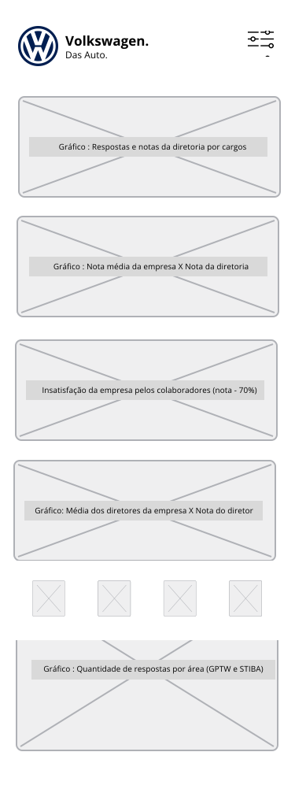

# Sumário

[1. Persona](#c1)

[2. User Story](#c2)

[3. Wireframe Interface](#c3)

[4. Referências](#c4)

 

# 1. Persona

Uma persona é uma representação semi-fictícia do cliente ideal. Ela é um personagem fictício, baseado em dados reais sobre o comportamento e as características do parceiro. O objetivo é entender quem são os principais stakeholders do sistema e quais são suas necessidades.

## 1.1 Por que criar personas?

**Entendimento do público:** Com os perfis das personas criados, pode-se compreender mais acerca das características demográficas, comportamentais e necessidades específicas de cada grupo.

**Personalizar a experiência do usuário:** Após a identificação do que o cliente precisa, suas necessidades e desejos, é possível adaptar a interface com as funcionalidades necessárias para atender as expectativas.

## 1.2 Especificações para o projeto

**Entendimento da estrutura organizacional:** Com os atores criados é possível identificar os papéis deles no sistema, personalizando o dashboard de acordo com os departamentos e acessos. Além de possibilitar uma tomada de decisão mais embasada. 

**Preferências de visualização:** Entendendo o comportamento daquele usuário é possível criar visualizações voltadas ao seu conhecimento e preferência, para atender as suas necessidades diárias. 

## 1.3 Personas Criadas

### 1.3.1 Lucas Gonçalvez - VP de RH

### 1.3.2 Cintia Souza - CEO Volkswagen BR

# 2. User Story

Uma história do usuário, é um texto que descrever uma funcionalidade ou requisito do ponto de vista do usuário. O objetivo é conseguir mapear as funcionalidades e interações que ocorreram no sistema.  

## 2.1 Benefícios

**Foco no Usuário:** Por ser centrada no usuário, auxilia no desenvolvimento das necessidades reais. Priorizando funcionalidades com base no valor que agregam ao usuário

**Compreensão:** Por apresentarem um caso por vez, serem curtas e conter exemplos, facilita a comunicação entre os desenvolvedores e os stakeholders.

**Flexibilidade:** As histórias podem ser adaptadas conforme novas necessidades, o que contribui para a flexibilidade no desenvolvimento.

## 2.2 User Story criadas

###  **US01 - Gerenciamento de acesso de usuários**

**Persona:** Vice-presidente de RH

**História:** Como Vice-presidente de RH, desejo ter a capacidade de gerenciar os acessos dos usuários para garantir a segurança das informações no dashboard.

**Critério de avaliação:**

- **Critério 1:** A plataforma deve fornecer um sistema de login seguro, exigindo autenticação e autorização adequadas.
  - **Condição:** { Verificar se o sistema de login possui autenticação com base em permissões previamente configuradas, para garantir que apenas usuários autorizados possam acessar o dashboard. }

- **Critério 2:** Após o login, caso necessário o Vice-presidente tem liberação para realizar modificações no sistema, gerenciando o acesso dos colaboradores.
  - **Condição:** { Verificar se o vice-presidente de RH tem a capacidade de adicionar, remover e modificar os acessos dos usuários. }

**Teste de aceitação:**

- **Teste 1:** A plataforma exige um login válido para acessar o dashboard.
  - **Aprovado:** { A autenticação é bem-sucedida com informações válidas. }
  - **Recusado:** { Se for possível acessar o dashboard sem autenticação ou se houver falhas no login. }

- **Teste 2:** O VP de RH, consegue adicionar um novo usuário e liberar o acesso.
    - **Aprovado:** { O novo usuário é adicionado com sucesso e recebe os acessos conforme configurado pelo administrador. }
    - **Recusado:** { Se houver problemas ao adicionar um novo usuário ou se os acessos não forem concedidos corretamente. }

 

###  **US02 - Seleção de Período de Tempo no Dashboard**

**Persona:** CEO Volkswagen BR

**História:** Como CEO Volkswagen BR, desejo ter a capacidade de selecionar um período de tempo específico para visualizar os dados no dashboard, permitindo uma análise mais precisa da evolução da empresa ao longo dos anos.

**Critério de avaliação:**

- **Critério 1:** O dashboard deve fornecer opções de seleção de período de tempo anual.
  - **Condição:** { Verificar se o dashboard oferece opção de visualização da dados anual, além da possibilidade de selecionar um ano em específico.}

- **Critério 2:** A seleção do período de tempo deve refletir imediatamente na visualização dos dados.
  - **Condição:** { Ao selecionar um período de tempo, os dados exibidos no dashboard devem ser atualizados de forma rápida apresentando as informações do ano especificado. }

**Teste de aceitação:**

**Teste 1:** O usuário consegue selecionar um período de tempo específico no dashboard.
- **Aprovado:** { As opções de seleção de período de tempo estão disponíveis e a página de dados anuais está carregando conforme esperado. }
- **Recusado:** { Se houver problemas ao tentar selecionar um período de tempo ou se as opções não estiverem visíveis. }

**Teste 2:** Após selecionar um período de tempo, a visualização dos dados é atualizada conforme o período escolhido.

**Aprovado:** { A visualização dos dados é ajustada de acordo com o período de tempo selecionado. }
**Recusado:** { Se a visualização dos dados não for atualizada corretamente ou se houver atrasos na atualização. }

 

###  **US03 - Seleção de Área no Dashboard**

**Persona:** CEO Volkswagen BR

**História:** Como CEO Volkswagen BR, desejo ter a capacidade de selecionar tópicos específicas, como plantas e unidades, para visualizar dados relacionados a essas áreas no dashboard.

**Critério de avaliação:**

- **Critério 1:** O dashboard deve oferecer opções de seleção de tópicos, como plantas e unidades.
  - **Condição:** { Verificar se o dashboard fornece opções de seleção com filtros para as plantas e unidades da empresa para análises específicas desses locais. }

- **Critério 2:** A seleção de tópicos deve filtrar os dados apresentados no dashboard.
  - **Condição:** { Ao selecionar um tópicos específica, os dados exibidos no dashboard devem ser filtrados de acordo com o escolhido. }

**Teste de aceitação:**

- **Teste 1:** O usuário pode selecionar um tópico específica, como uma plantas e/ou unidade, no dashboard.
  - **Aprovado:** { As opções de seleção de plantas e/ou unidade estão disponíveis em todas as páginas do dashboard. }
  - **Recusado:** { Se houver problemas ao tentar selecionar uma plantas e/ou unidade ou se as opções não estiverem visíveis. }

- **Teste 2:** Após selecionar uma plantas e/ou unidade, a visualização dos dados é filtrada para mostrar apenas informações relacionadas ao tópico escolhido.

  - **Aprovado:** { A visualização dos dados é filtrada de acordo com a tópico escolhida, atualizando o dashboard com as informações específicas dele. }
  - **Recusado:** { Se a visualização dos dados não for filtrada corretamente ou se houver atrasos na aplicação do filtro. }

 

###  **US04 - Área de Configuração, Acessibilidade e Tour para Usuários**

**Persona:** Vice-presidente de RH

**História:** Como Vice-presidente de RH, desejo ter uma área de configuração intuitiva, opções de acessibilidade e um tour explicativo para visualizar as funcionalidades do dashboard.

**Critério de avaliação:**

- **Critério 1:** O dashboard deve incluir uma área de configuração que permita aos usuários personalizar o tema do dashboard e conseguir acessar o tuor pela plataforma.
  - **Condição:** { Verificar se a área de configuração está visível e oferece opções de personalização de tema para *dark mode*. }

- **Critério 2:** Um tour explicativo deve ser fornecido para orientar os usuários sobre as funcionalidades do dashboard.
  - **Condição:** { Verificar se nas configurações os usuários conseguem acessar um tour que mostra as principais funcionalidades do dashboard.}
  
**Teste de aceitação:**

- **Teste 1:** A opção de acessibilidade, mudança do tema do dashboard, está funcionando conforme esperado.
  - **Aprovado:** { As opções de acessibilidade permite a escolha do modo de exbição da platafoma *(dark e ligth mode)* que possibilita a utilização com as preferências dos usuários. }
  - **Recusado:** { Se as opções de acessibilidade não estiverem funcionando corretamente ou se não estiverem disponíveis. }
  
- **Teste 2:** O tour explicativo mostra ao usuário as principais funcionalidades do dashboard.
  - **Aprovado:** { O tour é informativo e orienta os usuários pelas funcionalidades do dashboard de maneira compreensível. }
  - **Recusado:** { Se o tour não fornecer informações claras ou se não estiver disponível. }

 

###  **US05 - Visualização de Gráficos e Indicadores no Dashboard**

**Persona:** Vice-presidente de RH

**História:** Como Vice-presidente de RH, desejo ter uma representação visual dados de pesquisa e saúde mental dos colaboradores, apresentando gráficos e indicadores no dashboard.

**Critério de avaliação:**

- **Critério 1:** O dashboard deve incluir gráficos para representar visualmente os dados.
  - **Condição:** { Verificar se o dashboard apresenta gráficos que representam visualmente os dados de saúde mental e pesquisa dos colaboradores de forma clara e compreensível. }

- **Critério 2:** Indicadores-chave de desempenho (KPIs) devem ser destacados no dashboard.
  - **Condição:** { Verificar se os principais indicadores de desempenho da empresa são facilmente identificáveis no dashboard. }

**Teste de aceitação:**

- **Teste 1:** Os gráficos apresentam as informações de saúde mental de maneira clara e compreensível para um acompanhemtento mais efetivo.
  - **Aprovado:** { Os gráficos são escolhidos de form assertiva para a representação visual dos dados, proporcionando uma compreensão clara das informações. }
  - **Recusado:** { Se os gráficos não forem claros, confusos ou se não estiverem disponíveis. }

- **Teste 2:** Os indicadores-chave de desempenho (KPIs) são destacados e facilmente identificáveis no dashboard.
  - **Aprovado:** { Os KPIs apresentados pertitem uma rápida identificação e análise do desempenho dos colaboradores da empresa nas pesquisas. }
  - **Recusado:** { Se os KPIs não estiverem destacados ou se não estiverem visíveis no dashboard. }

 

# 3. Wireframe Interface

## 3.1 O que é um Wireframe 

Um wireframe é uma representação visual básica de uma interface, serve como um guia visual para validar a estrutura e o layout, mostrando os elementos principais e suas relações, mas sem detalhes gráficos. É utilizado para planejar a disposição dos elementos permitindo que as partes interessadas entendam a organização do conteúdo e a navegação antes que o design detalhado ocarra. 

## 3.2 Processo de criação do wireframe

Ao desenvolver o wireframe para o projeto do dashboard para análise de pesquisas e saúde mental dos colaboradores da Volkswagen, foi levado em consideração o ambiente diversificado com várias plantas e unidades. Criando versões tanto para web quanto para dispositivos móveis, destacando a necessidade de personalização na disposição do conteúdo em ambos os formatos, com o objetivo de proporcionar uma boa experiência do usuário. Além disso, foi pensada uma opção de dark mode, visando assegurar a acessibilidade e permitir que os usuários escolham suas preferências de uso.

## 3.2.1 Web e Mobile

Projetar wireframes tanto para dispositivos móveis quanto para web proporciona uma abordagem multiplataformam, além de alguns benefícios, como: 

- **Variedade de dispositivos:** Os usuários podem acessar informações por meio diferentes dispositivos, como smartphones, tablets, laptops e desktops. Garantindo que a experiência seja consistente mesmo que em diferentes tamanhos de tela e contextos de uso.

- **Personalização:** Quando pensado para ambas as plataformas, é possível personalizar a disposição e interação de acordo com as características específicas de cada tela. Ao mesmo tempo, é importante manter elementos padronizados, familiar com o cotidiano do usuário. 

## 3.2.2 Dark mode 

A importância de projetar wireframes considerando diferentes temas de tela está relacionada ao aprimoramento da experiência do usuário e às preferências individuais. 

- **Conforto Visual:** Oferecer alternativas para os olhos em ambientes de baixa luminosidade. 
  
- **Economia de Energia:** Dispositivos que utilizam telas OLED ou AMOLED, o dark mode pode ajudar a economizar energia, pois pixels pretos consomem menos energia do que pixels brancos ou coloridos
  
- **Preferências do Usuário:** Proporcionar ao usuário a opção de escolher oferecendo experiência mais personalizada.
  
- **Acessibilidade:** Para usuários com sensibilidade à luz ou condições médicas específicas, o dark mode pode melhorar a acessibilidade. 

## 3.3 Wireframe

Apresenta-se abaixo cada tela desenvolvida explicando primeiramente seu conteúdo, seguido das imagens web (ligth e dark mode) e mobile (ligth e dark mode). O menu é dividido em 1) Home; 2) Visão Anual; 3) Visão Diretoria, apresentado nos tópicos abaixo. 

 

  
  

  O grupo considerou a criação dos artefatos com uma perspectiva que parte do nível macro para o micro da empresa. Isso pois, ao liberar a visão destinada às pessoas com maior acesso e, consequentemente, mais conteúdo, qualquer adição futura em outras áreas exigirá apenas a restrição de acesso aos conteúdos já existentes.

 

### 3.3.1 Filtros

Os filtros oferecem uma experiência personalizada aos usuários, facilitando a localização de informações relevantes. Abaixo estão os detalhes dos filtros disponíveis. 

 

<figure style="display: flex;">
  

    
    <figcaption style=" text-align: center;">Wireframe - Filtros - Mobile Light Mode</figcaption>
  

  

    
    <figcaption style="text-align: center;">Wireframe - Filtros - Mobile Dark Mode</figcaption>
  

</figure>

 

**Categoria de Trabalho:**

- **Descrição:** Este filtro permite ao usuário filtrar itens com base em categorias de trabalho específicas.
- **Funcionalidade:**
  - Uma lista de categorias de trabalho é exibida.
  - O usuário pode selecionar uma ou mais categorias.
  - Os itens exibidos são filtrados de acordo com as categorias selecionadas.

**Gênero:**
- **Descrição:** Este filtro permite ao usuário filtrar itens com base em gênero.
- **Funcionalidade Gênero e Categoria de Trabalho:**
  - Uma lista de opções de gênero é apresentada.
  - O usuário pode escolher uma ou mais opções.
  - Os itens são filtrados de acordo com as opções de gênero selecionadas.

**Idade:**
- **Descrição:** Este filtro permite ao usuário definir um intervalo de idade para filtrar itens.

- **Funcionalidade:**
  - Um elemento deslizante são fornecidos para definir o intervalo de idade desejado.
  - Os itens são filtrados com base no intervalo de idade selecionado.

 

  
  

  Após a conversa com o cliente <i>(16 de fev, 2023)</i>, ficou previsto a troca para um range de idades, de 5 em 5 anos, para a próxima sprint.

 

**Planta:**

- **Descrição:** Este filtro permite ao usuário selecionar uma planta específica da empresa.

- **Funcionalidade:**
  - O usuário clica no botão "Planta" para abrir um modal.
  - No modal, são listadas todas as plantas disponíveis.
  - O usuário pode escolher uma planta a partir da lista.

 

<figcaption style=" text-align: center;">Wireframe - Filtro Planta - Web Light Mode</figcaption>

 

<figcaption style=" text-align: center;">Wireframe - Filtro Planta - Web Dark Mode</figcaption>

 

<figure style="display: flex;">
  

    
    <figcaption style=" text-align: center;">Wireframe - Filtro Planta - Mobile Light Mode</figcaption>
  

  

    
    <figcaption style="text-align: center;">Wireframe - Filtro Planta - Mobile Dark Mode</figcaption>
  

</figure>

 

**Unidade:**

- **Descrição:** Este filtro permite ao usuário selecionar uma unidade específica dentro da planta escolhida.

- **Funcionalidade:**
  - Após selecionar uma planta, o usuário pode clicar no botão "Unidade" para abrir um novo modal.
  - O modal exibe todas as unidades disponíveis na planta selecionada.
  - O usuário pode escolher uma unidade a partir da lista.

 

<figcaption style=" text-align: center;">Wireframe - Filtro Unidade - Web Light Mode</figcaption>

 

<figcaption style=" text-align: center;">Wireframe - Filtro Unidade - Web Dark Mode</figcaption>

 

<figure style="display: flex;">
  

    
    <figcaption style=" text-align: center;">Wireframe - Filtro Unidade - Mobile Light Mode</figcaption>
  

  

    
    <figcaption style="text-align: center;">Wireframe - Filtro Unidade - Mobile Dark Mode</figcaption>
  

</figure>

 

**Diretoria:**

- **Descrição:** Este filtro permite ao usuário selecionar uma diretoria específica da empresa.

- **Funcionalidade:**
  - O usuário aciona o botão "Diretoria" para abrir um modal.
  - No modal, são listadas todas as diretorias disponíveis.
  - O usuário pode escolher uma diretoria a partir da lista.

 

<figcaption style=" text-align: center;">Wireframe - Filtro Diretoria - Web Light Mode</figcaption>

 

<figcaption style=" text-align: center;">Wireframe - Filtro Diretoria - Web Dark Mode</figcaption>

 

<figure style="display: flex;">
  

    
    <figcaption style=" text-align: center;">Wireframe - Filtro Diretoria - Mobile Light Mode</figcaption>
  

  

    
    <figcaption style="text-align: center;">Wireframe - Filtro Diretoria - Mobile Dark Mode</figcaption>
  

</figure>

 

### 3.3.2 Dashboard

**Dashboard Geral:**

1. **% de Respostas - STIBA e GPTW:** A comparação das taxas de resposta entre as pesquisas SHIBA e GPTW permite identificar a adesão dos colaboradores a cada uma delas. Isso é importante para entender o engajamento em diferentes tipos de pesquisas e possivelmente atuar para entender os números de cada uma delas.
2. **Quantidade de respostas X Quantidade de colaboradores X Cargo de trabalho:** Ao segmentar as respostas por cargo, tem se uma análise mais específica das respostas de diferentes níveis hierárquicos. Isso ajuda a identificar padrões de satisfação ou insatisfação em cada camada da organização.
3. **Quantidade de respostas X Quantidade de colaboradores X Área:** Segmentar por área permite analisar as respostas de forma mais granular, identificando possíveis variações nas percepções entre diferentes setores da empresa. Permitindo atuação na construção de  estratégias de melhoria específicas para cada área.

 

<figcaption style=" text-align: center;">Wireframe - Dashboard Geral - Web Light Mode</figcaption>

 

<figcaption style=" text-align: center;">Wireframe - Dashboard Geral - Web Dark Mode</figcaption>

 

<figure style="display: flex;">
  

    
    <figcaption style=" text-align: center;">Wireframe - Dashboard Geral - Mobile Light Mode</figcaption>
  

  

    
    <figcaption style="text-align: center;">Wireframe - Dashboard Geral - Mobile Dark Mode</figcaption>
  

</figure>

 

**Dashboard Anual:**

1. **Taxa de resposta por ano - STIBA e GPTW:** Análise anual das taxas de resposta ao longo dos anos, indicando períodos de maior ou menor engajamento dos colaboradores.
2. **Áreas com menos de 70% de desempenho:** Identificar as áreas com desempenho inferior a 70% permite focar esforços de melhoria nas esferas críticas da organização, atuando em ações direcionadas para elevar a satisfação nessas áreas.
3. **5 perguntas com maior nota e 5 perguntas com menor nota:** Destacar as perguntas com as maiores e menores notas (STIBA e GTPW) para levantas aspectos mais positivos e negativos da experiência dos colaboradores, orientando ações de melhoria.
4. **Nota da empresa (GPTW e SHIBA) ao longo dos anos:** Identificar tendências de satisfação global, permitindo avaliar o impacto de iniciativas e/ou mudanças organizacionais.

 

<figcaption style=" text-align: center;">Wireframe - Dashboard Anual - Web Light Mode</figcaption>

 

<figcaption style=" text-align: center;">Wireframe - Dashboard Anual - Web Dark Mode</figcaption>

 

<figure style="display: flex;">
  

    
    <figcaption style=" text-align: center;">Wireframe - Dashboard Anual - Mobile Light Mode</figcaption>
  

  

    
    <figcaption style="text-align: center;">Wireframe - Dashboard Anual - Mobile Dark Mode</figcaption>
  

</figure>

 

**Dashboard Diretoria:**

1. **Quantidade de respostas e notas da diretoria por cargos:** Essa análise proporciona uma visão das percepções dos colaboradores em relação à diretoria, destacando áreas específicas que podem demandar atenção.
2. **% de insatisfação da empresa pelos colaboradores (nota - 70%):** Monitorar a porcentagem de insatisfação para identificar áreas críticas que requerem intervenção imediata, contribuindo para a gestão da satisfação dos colaboradores.
3. **Nota média da empresa X Nota média da diretoria:** Comparar a nota média da empresa com a nota média da diretoria ajuda a entender como a liderança é percebida em relação ao ambiente organizacional como um todo.
4. **Média dos diretores da empresa X Nota do diretor correspondente:** Essa métrica permite que os líderes avaliem seu desempenho em relação à média da diretoria, facilitando a identificação de áreas de destaque ou melhoria.

 

  
  
  
    

    Após a conversa com o cliente <i>(16 de fev, 2023)</i>, foi revisada a seção da diretoria na qual um diretor teria acesso às notas dos outros diretores. A política da empresa não permite a exibição de tal comparação, com o objetivo de evitar conflitos e/ou competição interna.

    <b style="color: #1A57B1; margin: 13px 10px;">Este conteúdo será ajustado para a Sprint 2.</b>
  

 

5. **Quantidade de respostas por área (GPTW e STIBA):** Distribuir as respostas por área fornece uma análise das percepções dos colaboradores de cada área sobre a diretoria, permitindo que ela compreenda as particularidades de cada setor e organize estratégias de melhoria.

 

<figcaption style=" text-align: center;">Wireframe - Dashboard Diretoria - Web Light Mode</figcaption>

 

<figcaption style=" text-align: center;">Wireframe - Dashboard Diretoria - Web Dark Mode</figcaption>

 

<figure style="display: flex;">
  

    
    <figcaption style=" text-align: center;">Wireframe - Dashboard Diretoria - Mobile Light Mode</figcaption>
  

  

    
    <figcaption style="text-align: center;">Wireframe - Dashboard Diretoria - Mobile Dark Mode</figcaption>
  

</figure>

 

**Saúde Mental:**

1. **Principais doenças por área :** Analisar as principais doenças enfrentadas pelos colaboradores em cada área, fornecendo insights para estratégias de apoio.
2. **Quantidade de atestados por mês:** Análise da quantidade de atestados emitidos, destacando períodos de maior ou menor demanda por parte dos colaboradores. 
3. **Média de dias abonados por mês:** Analisar a média de dias de afastamento por mês entre os colaboradores, categorizando as causas e destacando períodos de maior incidência.
4. **Quantidade de atestados por área:** Identificar as áreas com maior número de atestados, atuando em ações direcionadas para diminuir a quantidade.
5. **Quantidade de atestados por cargo:** Identificar os cargos que apresentam maior frequência de afastamento por motivos de saúde.
6. **Colaboradores que utilizaram o convênio x Colaboradores que responderam as pesquisas**: Comparar o número de colaboradores que utilizaram o convênio médico com aqueles que responderam às pesquisas de saúde mental para entender se tem alguma relação e a eficácia das iniciativas de apoio disponibilizadas pela empresa.

 

<figcaption style=" text-align: center;">Wireframe - Saúde Mental - Web Light Mode</figcaption>

 

<figcaption style=" text-align: center;">Wireframe - Saúde Mental - Web Dark Mode</figcaption>

 

<figure style="display: flex;">
  

    
    <figcaption style=" text-align: center;">Wireframe - Saúde Mental - Mobile Light Mode</figcaption>
  

  

    
    <figcaption style="text-align: center;">Wireframe - Saúde Mental - Mobile Dark Mode</figcaption>
  

</figure>

 

## 3.4 Decisões de design

Os feedbacks obtidos dos clientes foram incorporados na explicação dos wireframes fornecida anteriormente.

### 3.4.1 **Padronização dos elementos**

A implementação de uma padronização nos elementos proporciona uma continuidade visual e familiaridade nos dashboards. Ao analisar o wireframe, observamos a presença de elementos similares entre diferentes páginas. Um exemplo disso é nos filtros, nos quais apresenta-se os mesmos elementos para distintos tipos de filtros. 

### 3.4.2 **Responsividade**

A escolha dos elementos do projeto buscam atender tanto ao desktop quanto ao mobile. Utilizamos como base para a criação do wireframe a biblioteca de componentes <a href="https://mui.com/material-ui/">Material UI</a> pois seus componentes possibilitam responsividade, assegurando um fluxo flúido entre ambas as plataformas, ao mesmo tempo em que facilita o processo de desenvolvimento. Ao comparar as páginas desktop e mobile, nota-se a uniformidade nos elementos adotados, buscando eliminar a necessidade de criar novos elementos específicos.

## 3.5 Técnicas de design

### 3.5.1 **Uso de Grid**

O uso de um grid é utilizado para organizar elementos de maneira consistente, sendo linhas horizontais e verticais que dividem o espaço do layout em seções regulares. Essas linhas são como guias para alinhar e distribuir elementos de forma equilibrada nas páginas.

Essa técnica foi aplicada ao alinhar os elementos do wireframe seguindo uma orientação de grid (principalmente no espaçamento entre os gráficos), o que possibilita uma padronização do alinhamento entre os elementos das páginas.

  - **Considerações:** É necessário aplicar diferentes números de colunas dependendo de qual o tamanho da tela está sendo utilizado, seja mobile ou desktop. 

 

### 3.5.2 **Hierarquia visual em z**

Utilizada para direcionar o caminho que o usuário percorre com os olhos ao entrar em uma página (semelhante a letra Z). Dessa forma, os elementos são dispostos conforme esse fluxo, priorizando a visualização dos tópicos que se deseja que o usuário perceba primeiro.

No wireframe priorizou-se a colocação de KPI's na parte inicial seguindo a lógica da visualização em Z. Os dados iniciam-se com uma visão macro da empresa, e à medida percorrem a página para baixo, é possível obter uma visão mais granular.

  - **Considerações:** Tomou-se cuidado na hora da escolha dos conteúdos implementado para garantir que o fluxo do macro para o micro seja mantido e faça sentido.

## 3.6 Link Figma

https://www.figma.com/file/X7zrBZLA2KC8Ot9aL15BCg/Wireframe?type=design&node-id=166%3A2892&mode=design&t=360rPAaGfi6zWjCb-1

# 4. Referências

Awari. Utilizando o Dark Mode para melhorar a usabilidade de uma Aplicação. [S. l.]: Awari, 17 de janeiro de 2023. Disponível em: https://awari.com.br/dark-mode/?utm_source=blog&utm_campaign=projeto+blog&utm_medium=Utilizando%20o%20Dark%20Mode%20para%20melhorar%20a%20usabilidade%20de%20uma%20Aplica%C3%A7%C3%A3o#:~:text=Um%20dos%20principais%20benef%C3%ADcios%20do,e%20interagindo%20com%20o%20conte%C3%BAdo. Acesso em: 5 fev. 2024.

CONTENT, Redator Rock. Wireframes: quais os tipos e as principais ferramentas de criação. [S. l.]: Rockcontent, 26 de fevereiro de 2019. Disponível em: https://rockcontent.com/br/blog/wireframes/. Acesso em: 5 fev. 2024.

KWG, G. Entenda porque você deveria usar Grid nas suas criações. Disponível em: <https://blog.graficakwg.com.br/destaque/grid-para-criacao/>. Acesso em: 9 fev. 2024.

REHKOPF, Max. Histórias de usuários com exemplos e um template :  Histórias de usuários, ou user stories, são tarefas de desenvolvimento expressas, em geral, como "persona + necessidade + propósito". [S. l.]: Atlassian. Disponível em: https://www.atlassian.com/br/agile/project-management/user-stories. Acesso em: 2 fev. 2024.

SIQUEIRA, André. Persona: o que é, como definir e por que criar uma para sua empresa: [+ exemplos práticos e um gerador]. [S. l.]: Resultados Digitais, 14 fev. 2022. Disponível em: https://resultadosdigitais.com.br/marketing/persona-o-que-e/. Acesso em: 2 fev. 2024.

VASCONCELOS, P. A importância da Hierarquia Visual. Disponível em: <https://designculture.com.br/a-importancia-da-hierarquia-visual/>.Acesso em: 9 fev. 2024.

