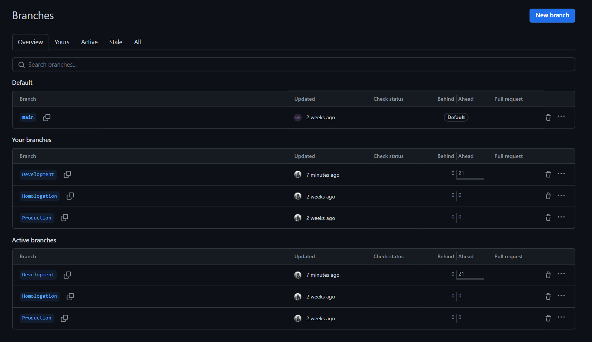

# 1. Branches

## 1.1 O que são Branches

Branches (Ramificações), são cópias do código-fonte principal de um projeto. Permitem trabalhar em diferentes versões do software simultaneamente, sem afetar a versão principal ("main").

## 1.2 Tipos de branches utilizadas no projeto

- **Main:** Local principal de desenvolvimento do projeto, onde fica a versão mais recente.
- **Development:** Local onde as novas funcionalidades são desenvolvidas e testadas.
- **Homologation:** Local onde a versão final do software é testada antes de ser lançada em produção.
- **Production:** Local que contém a versão do software que está disponível para os usuários finais.

 

**Observação:** Como no Inteli os projetos só são liberados para produção na semana 10, as funcionalidades prontas e testadas serão armazenadas na ***"Main"*** até o momento. Poderá ocorrer alterações mediante intrução do professor de programação.

 
Figura 1 : Branches no GitHub 
Fonte: Elaboração própria

## 2. Utilização das branches

**Desenvolvimento de Novas Funcionalidades:** 
- Criar uma branch a partir da main para desenvolver a nova funcionalidade.
- Desenvolver a funcionalidade e realizar testes.
- Mesclar a branch de volta na main quando a funcionalidade estiver pronta.

**Correções de Bugs:**

- Criar uma branch a partir da main para corrigir o bug.
- Corrigir o bug e realizar testes.
- Mesclar a branch de volta na main quando a correção estiver pronta.
  
**Testes:**
- Criar uma branch a partir da main para realizar testes.
- Realizar os testes na branch.
- Realizar o merge caso eles sejam aprovados. 
- Descartar a branch após os testes serem concluídos. 
  
### 2.1 Vantagens de utilização

- Possibilidade de diferentes equipes trabalhem simultaneamente.
- Facilita o desenvolvimento e teste de novas funcionalidades sem afetar a versão principal.

### 2.2 Desvantagens de utilização

- Pode haver conflitos de mesclagem quando branches são mescladas de volta na main.
  
 

# 3. Referências

Git (2023). Git Book. Disponível em: https://git-scm.com/book/en/v2/Git-Basics-Recording-Changes-to-the-Repository. Acesso em: 17 de Fevereiro de 2024.