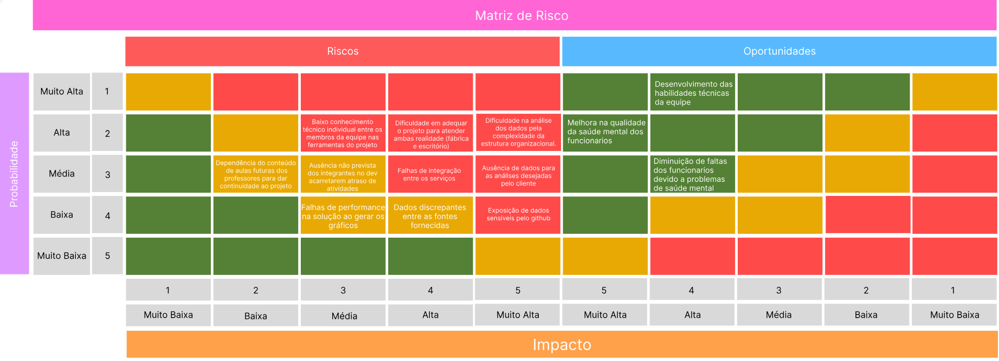
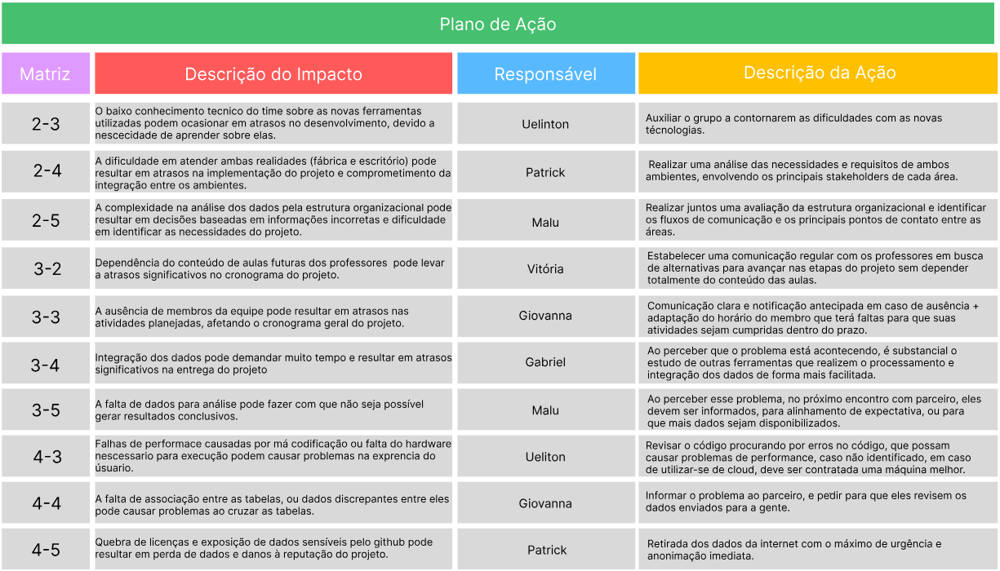

# 1. Canvas Proposta de Valor

&emsp;&emsp; O Canvas proposta de valor é uma forma de descrever os benefícios que um produto ou serviço oferece ao cliente, e como ele resolve seus problemas ou satisfaz suas necessidades. Para isso, o canvas é dividida em 2 partes: Segmentos do Cliente (direta) e Proposta de Valor (Esquerda), o primeiro aborda as tarefas do cliente, os ganhos e as dores, já o segundo aborda o produtos, os criadores de ganho e os aliviadores de dores. Abaixo há uma explicação sobre cada tópico presente na figura 1.

&emsp;&emsp; Tarefas do Cliente: Hoje, o cliente deve realizar a identificação das causas raízes dos problemas de saúde mental no ambiente de trabalho para implementar medidas corretivas eficazes. Além disso, ele também realiza a coleta e análise de dados.

&emsp;&emsp; Ganhos: Ao adotar o dashboard de saúde mental, o cliente terá acesso a indicadores de engajamento, o que facilita a compreensão do panorama geral do bem-estar dos colaboradores. Além disso, o produto possibilita a identificação de possíveis causas raízes para os desafios de saúde mental da empresa, que permite uma intervenção mais precisa. Além disso, os líderes terão acesso direto a relatórios analíticos, possibilitando uma continuidade mais eficiente no atendimento aos colaboradores.

&emsp;&emsp; Dores: As dores enfrentadas pelo cliente incluem a análise manual de dados, que é demorada e propensa a erros. A dependência de plataformas e softwares de terceiros também pode ser uma barreira, já que caso essa plataforma esteja fora do ar, a empresa acaba atrasando o seu processo. Por último, algo citado no WorkShop foi a falta de uma visualização clara dos indicadores de saúde mental dentro da área de RH.

&emsp;&emsp; Criadores de Ganhos: O dashboard proposto oferece vantagens, como a visualização do engajamento e das causas raízes específicas de cada unidade organizacional da empresa. Além disso, proporciona acesso e autenticação exclusivos para os líderes de cada área, garantindo que tenham as informações necessárias.

&emsp;&emsp; Aliviadores de Dores: A plataforma será de propriedade própria, então elimina-se a dependência de terceiros, proporcionando maior controle. O acesso universal para o VP de RH facilita a gestão e supervisão do sistema.

Figura 4: Jornada - Analista de Dados   
Fonte: Elaboração própria

# 2. Matriz de Risco
É uma das principais ferramentas na análise de negócios para identificar, avaliar e priorizar os riscos existentes na solução desenvolvida. Ela contribui para a tomada de decisões mais informadas por facilitar a priorização de riscos por meio de sua probabilidade e impacto. 

A figura abaixo ilustra a construção da matriz de risco e seu plano de ação para o projeto.

