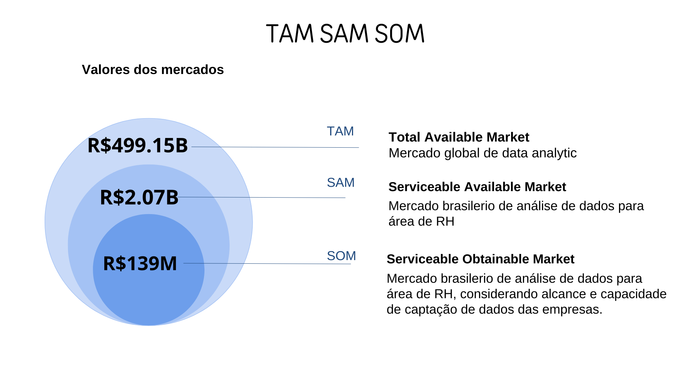
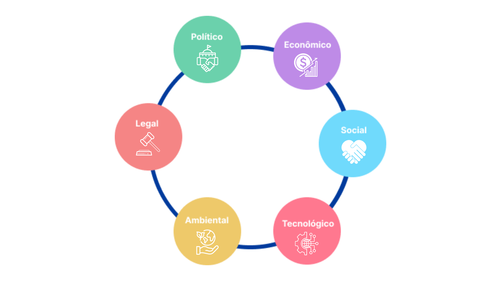
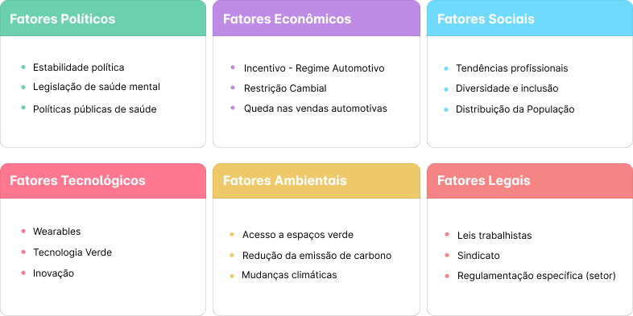

# Sumário

[1. TAM SAM SOM](#c1)

[2. PESTEL](#c2)

[3. Matriz de Risco](#c3)

[4. Referências](#c4)

 

#  1. TAM SAM SOM

## 1.1 Definição

- **TAM (Total Addressable Market):** Representa o mercado total que poderia se beneficiar ou necessitar do serviço. Valor caso 100% do mercado adotasse seu produto.

- **SAM (Serviceable Addressable Market):** É a parcela do TAM que realmente pode ser alcançada por seu produto ou serviço, levando em consideração as limitações geográficas, de distribuição e a capacidade das ferramentas.

- **SOM (Serviceable Obtainable Market):** Representa a porção do SAM que se espera atingir em um determinado período de tempo, considerando fatores como concorrência, barreiras de entrada e estratégia de implementação.

## 1.2 Ánalise

Figura 01: TAM SAM SOM   
Fonte: Elaboração própria

### 1.2.1 TAM

- **Mercado:** Mercado global de data analytic.
- **Métrica utilizada:** (Mercado global de análise de RH).

**Cálculos**

Segundo [GlobalData(2023)](https://www.globaldata.com/store/report/data-and-analytics-market-analysis/), "O tamanho global do mercado de dados e análises foi estimado em US$ 100,8 bilhões em 2022".

100.84B x 4,95 =  499,15 bilhões Reais

TAM = 499,15 bilhões Reais

### 1.2.2 SAM 

- **Mercado:** Mercado brasilerio de análise de dados para área de RH.
- **Métrica utilizada:** A partir do mercado de people analytics no Brasil, e com base na participação do Brasil no mercado de analytics global, calculamos sua participação no mercado de people analytics.

**Cálculos:**

- Segundo [MORDOR INTELLIGENCE(2023)](https://www.mordorintelligence.com/industry-reports/hr-analytics-market), "O tamanho do mercado brasileiro de Big Data Analytics é estimado em US$ 9.8 bilhões em 2023".

- Segundo [GlobalData(2022)](https://www.globaldata.com/store/report/data-and-analytics-market-analysis/), "O tamanho global do mercado de dados e análises foi estimado em US$ 100,8 bilhões em 2022".

- Segundo [MORDOR INTELLIGENCE(2024)](https://www.mordorintelligence.com/industry-reports/hr-analytics-market), "O tamanho do mercado de análise de RH é estimado em US$ 4,31 bilhões em 2024".

Calculando a participação do Brasil no mercado de data analytics:

9.8B/100.84B = 9,72% 

calculando o valor estimado do mercado de people analytics no Brasil:

4.31B * 9,72% = 419 milhões dólares
419M * 4,95 = 2.07 bilhões de reais

SAM = 2.07 bilhões de reais 

### 1.2.3 SOM 

- **Mercado:** Mercado brasilerio de análise de dados para área de RH, considerando empresas com porte para captação desses dados e nossa capacidade de comunicação limitada a cidade de são paulo.
- **Métrica utilizada:** Alcance da nossa solução no mercado brasilerio de análise de dados para área de RH. Sendo limitado pelo mercado representado pela cidade de São Paulo e pelo mercado de empresas de grande porte.

**Cálculos:**

- Segundo [Suno Research(2023)](https://www.suno.com.br/noticias/sao-paulo-gerador-riqueza-pib-ibge-evm/), "São Paulo foi a maior geradora de riqueza, com uma fatia de 9,2% do Produto Interno Bruto (PIB) brasileiro".

- Segundo [Sebrae(2023)](https://sebrae.com.br/sites/PortalSebrae/ufs/mt/noticias/micro-e-pequenas-empresas-geram-27-do-pib-do-brasil,ad0fc70646467410VgnVCM2000003c74010aRCRD), "Micro e pequenas empresas geram 27% do PIB do Brasil", assim fazendo com que grandes empresas gerem 73%.
  
Participação de São Paulo no mercado:  2.07 * 0.092 = 0.19 bilhões de reais

Participação de São Paulo no mercado, considerando porte das empresas: 0.19 * 0.73 = 0.139 bilhões de reais de reais

SOM = 139 Milhões de reais de reais

## 1.3 Cálculos no Excel

Os calculos do TAM SAM SOM foram realizados em um  forumulario GoogleSheets, segue o link para  visualização:

https://docs.google.com/spreadsheets/d/1eKsnnJWPey6Nqfa9deEINrp5o7ScH6me9yVZuMetlBY/edit?usp=sharing

#  2. PESTEL

&emsp;&emsp; A análise PESTEL é uma ferramenta para compreender o ambiente externo no qual uma empresa opera. Criada para avaliar os fatores políticos, econômicos, sociais, tecnológicos, ambientais e legais que podem moldar seu destino, essa metodologia oferece uma visão abrangente das influências que podem afetar seu desempenho e estratégias.

Figura 02: Análise PESTEL - Visão Geral  
Fonte: Elaboração própria

&emsp;&emsp; Cada um desses fatores não só representa áreas-chave de consideração, mas também engloba elementos específicos que podem ter um impacto na capacidade da empresa de prosperar e se adaptar ao produto que está sendo desenvolvido. Ao explorar esses fatores, as organizações podem identificar oportunidades, antecipar desafios e ajustar suas estratégias para melhor enfrentar as complexidades do ambiente empresarial em constante mudança.

Figura 03: Análise PESTEL - Visão Micro  
Fonte: Elaboração própria

## 2.1 Fatores Políticos

&emsp;&emsp;Os fatores políticos se referem ao ambiente político e governamental no qual a organização se encontra. Isso inclui a estabilidade política, a política fiscal, as regulamentações governamentais, as políticas comerciais, o nível de interferência do governo na economia.

### 2.1.1 Estabilidade política
	
&emsp;&emsp; A estabilidade política desempenha um papel importante na saúde mental das pessoas. Em países onde há estabilidade política, os cidadãos geralmente experimentam um senso de segurança e previsibilidade em relação ao seu ambiente social e econômico. Isso pode contribuir para níveis mais baixos de estresse e ansiedade, permitindo que as pessoas se concentrem mais em suas vidas pessoais e profissionais. Por outro lado, a instabilidade política pode ter efeitos adversos na saúde mental das pessoas. Conflitos internos, mudanças frequentes de liderança e incertezas geopolíticas podem criar um clima de tensão e medo. Isso pode levar a sintomas de ansiedade, depressão e até trauma em alguns casos. A constante preocupação com o futuro e o bem-estar pessoal e familiar pode desgastar a saúde mental das pessoas, tornando-as menos produtivas e felizes em suas vidas cotidianas.

#### 2.1.1.1 Impactos

- **Estresse e ansiedade:**  A incerteza política pode causar estresse significativo e ansiedade em indivíduos preocupados com seu futuro e segurança. A falta de previsibilidade sobre políticas governamentais e mudanças imprevistas pode levar a uma sensação de falta de controle sobre as próprias vidas, contribuindo para problemas de saúde mental.
- **Depressão:** A instabilidade política prolongada pode levar a sentimentos de desesperança e desamparo em relação ao futuro. As pessoas podem se sentir impotentes diante de mudanças constantes e de uma atmosfera de incerteza, o que pode desencadear sintomas de depressão em algumas pessoas.
- **Trauma psicológico:** Em situações de conflitos políticos ou violência, as pessoas podem experimentar traumas psicológicos graves. Testemunhar ou ser diretamente afetado por eventos traumáticos, como guerra civil, protestos violentos ou repressão política, pode causar danos psicológicos duradouros que requerem intervenção profissional.
- **Acesso limitado a serviços de saúde mental:** Em tempos de instabilidade política, os recursos para serviços de saúde mental podem ser escassos devido a cortes orçamentários, priorização de outras necessidades ou interrupções nos serviços devido a conflitos. Isso pode dificultar o acesso das pessoas a tratamentos e apoio adequados para suas necessidades de saúde mental.

#### 2.1.1.2 Mitigação dos Impactos

- **Promoção da estabilidade política:** Trabalhar para resolver conflitos políticos, promover o diálogo e fortalecer as instituições democráticas pode ajudar a criar um ambiente político mais estável e previsível.
- **Fornecimento de apoio psicossocial:** Investir em programas que ofereçam apoio psicossocial a indivíduos afetados pela instabilidade política, incluindo aconselhamento, terapia e grupos de apoio. Esses serviços podem ajudar as pessoas a lidar com o estresse, ansiedade e trauma associados à incerteza política.
- **Acesso a serviços de saúde mental:** Garantir que haja acesso a serviços de saúde mental, incluindo atendimento psicológico, psiquiátrico e social, é importante para garantir que as pessoas recebam o apoio de que necessitam.
Promoção da resiliência: Implementar programas de promoção da resiliência que ajudem as pessoas a desenvolver habilidades de enfrentamento e adaptação diante de situações de estresse e adversidade pode ser benéfico para proteger a saúde mental em tempos de instabilidade política.

### 2.1.2 Legislação de saúde mental

&emsp;&emsp; O trabalho desempenha um papel fundamental na vida das pessoas, sendo capaz de exercer um impacto significativo em sua saúde mental. Diariamente, trabalhadores enfrentam uma série de desafios que podem ter efeitos adversos nesse aspecto, tais como o estresse, o assédio moral, a sobrecarga de trabalho e a falta de reconhecimento e apoio por parte dos empregadores. O estresse decorrente do trabalho pode se originar de diversas fontes, como prazos apertados, alta demanda por produtividade e ambientes competitivos. Esse estresse crônico pode desencadear problemas de saúde mental, como ansiedade e depressão. A saúde mental é um direito fundamental do ser humano, e a legislação brasileira tem reconhecido cada vez mais a importância de proteger os trabalhadores contra práticas prejudiciais à saúde mental no local de trabalho. 

#### 2.1.2.1 Impactos:

- **Redução da produtividade:** O impacto negativo na saúde mental dos trabalhadores pode levar a uma redução significativa na produtividade do projeto. Trabalhadores que enfrentam problemas de saúde mental podem ter dificuldade em se concentrar, tomar decisões ou manter um desempenho consistente, afetando diretamente o progresso e a qualidade do projeto.
- **Aumento do absenteísmo:** Pode sobrecarregar os membros restantes da equipe, atrasar o cronograma do projeto e aumentar os custos devido à necessidade de cobrir as ausências.
- **Rotatividade de funcionários:** Um ambiente de trabalho que não oferece suporte adequado à saúde mental dos funcionários pode levar a uma alta rotatividade de pessoal. Os funcionários podem optar por deixar a empresa em busca de um ambiente mais saudável e solidário, resultando em interrupções no projeto devido à perda de conhecimento e experiência.

#### 2.1.2.2 Mitigação dos Impactos

- **Garantir conformidade:** Certificar de que o projeto esteja em conformidade com todas as leis e regulamentações relacionadas à saúde mental no local de trabalho. 
- **Educação e conscientização:** Promover a conscientização sobre saúde mental entre os funcionários e empregadores por meio de recursos educacionais, treinamentos ou materiais informativos. Isso pode ajudar a reduzir o estigma associado à saúde mental e incentivar uma cultura de apoio no local de trabalho.
- **Monitoramento contínuo:** Estabelecer mecanismos de monitoramento contínuo para acompanhar as mudanças na legislação de saúde mental e garantir que o projeto permaneça atualizado e em conformidade. 

### 2.1.3 Políticas públicas de saúde

&emsp;&emsp; A Convenção 155 da Organização Internacional do Trabalho estabelece diretrizes para a adoção de políticas nacionais abrangentes que promovam a saúde e segurança no trabalho, tanto por parte dos governos quanto das empresas. Ela destaca a importância de ações específicas para melhorar as condições de trabalho, todas adaptadas às realidades e práticas nacionais. O Protocolo associado a essa Convenção prevê a criação e revisão periódica de requisitos e procedimentos para registrar e notificar acidentes e doenças profissionais, bem como a divulgação de estatísticas anuais relacionadas a esses incidentes. Essas medidas visam garantir um ambiente de trabalho seguro e saudável para todos os trabalhadores, promovendo a prevenção de acidentes e a proteção da saúde ocupacional em todo o mundo.

#### 2.1.3.1 Impactos Negativo

- **Excesso de burocracia e regulamentações:** Dificulta a implementação das políticas e aumenta o estresse dos trabalhadores.
- **Dificuldade em acompanhar as mudanças e adaptações:** Gera insegurança e ansiedade nos trabalhadores.
- **Sensação de sobrecarga e pressão:** Aumenta o risco de burnout e outros problemas de saúde mental.

#### 2.1.3.2 Mitigação dos Impactos

- **Políticas de proteção ao emprego:** garantir a estabilidade no trabalho e reduzir o medo de demissões.
- **Programas de apoio à recolocação profissional:** auxiliar os trabalhadores que perderam seus empregos a encontrar novas oportunidades.
- **Promoção da cultura de diálogo e comunicação:** criar um ambiente onde os trabalhadores se sintam seguros para expressar suas preocupações.

## 2.2 Fatores Econômicos

&emsp;&emsp; As condições e variáveis relacionadas à economia de um país ou região podem impactar as operações e o desempenho de uma empresa. Esses fatores abrangem aspectos econômicos que podem influenciar as decisões de negócios e estratégias empresariais referente ao projeto desenvolvido.

### 2.2.1 Incentivo - Regime Automotivo

&emsp;&emsp; O Regime Automotivo, vigente até 2028, é uma política que incentiva a competitividade da indústria automobilística nacional. Através de benefícios fiscais e financeiros, o programa visa aumentar a produção de veículos e gerar empregos. Com as altas demandas pode-se gerar impactos na saúde mental dos trabalhadores:

- **Aumento da produção:** O regime impulsiona a produção, elevando a carga de trabalho dos funcionários.
- **Pressão por metas:** Os trabalhadores podem se sentir pressionados para alcançar metas ambiciosas, o que pode intensificar o estresse.
- **Múltiplas tarefas:** A necessidade de realizar diversas tarefas simultaneamente aumenta a carga mental e o risco de erros.
- **Jornada de trabalho extensa:** A sobrecarga pode levar à necessidade de horas extras e jornadas extensas, impactando negativamente a saúde mental.

#### 2.2.1.1 Impactos

- **Estresse:** Aumento da ansiedade, irritabilidade, fadiga mental e física.
- **Esgotamento:** Sensação de exaustão física e mental, levando à perda de motivação e produtividade.
- **Problemas de sono:** Dificuldade para dormir e manter o sono, impactando a qualidade do descanso e na concentração para realizar tarefas.
- **Ausência:** Faltas ao trabalho por motivos de saúde física ou mental.

#### 2.2.1.2 Mitigação dos impactos

- **Gestão da carga de trabalho:** Distribuição equilibrada das tarefas, definição de metas realistas e priorização de atividades.
- **Melhoria da comunicação:** Diálogo aberto entre líderes e colaboradores, promovendo feedback construtivo e reconhecimento do trabalho.
- **Jornada de trabalho flexível:** Implementar horários flexíveis e possibilidade de trabalho remoto para melhor gestão do tempo.

### 2.2.2 Restrição Cambial

&emsp;&emsp; A restrição cambial na Argentina (Local onde tem atuação da Volkswagen), intensificada nos últimos anos, gera impacto no setor automobilístico, com incertezas do mercado, a instabilidade cambial e o risco de demissões. A Argentina impôs restrições cambiais para conter a fuga de capital e proteger suas reservas internacionais, limitando a compra de dólares por argentinos, dificultando a importação de veículos brasileiros. Tal contexto pode contribuir para:

- **Estresse:** Preocupação com o futuro profissional e a capacidade de manter o emprego, gerando insegurança quanto à estabilidade da empresa e do setor;
- **Ansiedade:** Dificuldade em fazer planos a longo prazo, sensação de impotência e falta de controle sobre a situação, gerando medo de perder o emprego e não conseguir outro;
- **Inquietação:** Situação econômica e a desvalorização da moeda e aumento do absenteísmo e da rotatividade de funcionários.

#### 2.2.2.1 Mitigação dos impactos 

- **Comunicação clara e transparente:** A empresa deve manter os colaboradores informados sobre a situação do mercado e as medidas que estão sendo tomadas para minimizar os impactos.
- **Diversificação de mercados:** Avaliar estratégias de expansão em mercados mais estáveis e menos impactados por restrições cambiais. Diversificando a presença da empresa em outros locais, reduzindo a dependência da Argentina. 

### 2.2.3 Queda nas vendas automotivas

&emsp;&emsp; As vendas de veículos em 2024 enfrentaram um início turbulento, com quedas em diversos segmentos. Em janeiro, os emplacamentos de veículos novos recuaram 10,9% em relação ao mesmo período de 2023, e 45,7% na comparação com dezembro. Minas Gerais, por exemplo, registrou uma queda de 10,9% em janeiro, com 35,7 mil unidades emplacadas. Belo Horizonte também teve retração, com 16,5 mil emplacamentos, 25,8% menor que em janeiro de 2023. Embora existam projeções otimistas de crescimento de 12% para o ano, a desaceleração inicial pode ser atribuída a diversos fatores, apresentados abaixo.

#### 2.2.3.1 Redução da Demanda por Mão de Obra

&emsp;&emsp; Com menos carros sendo vendidos, as fábricas precisam de menos trabalhadores para produzi-los. Isso pode levar a demissões, suspensão de contratos, redução de horas extras e corte de benefícios. A indústria de autopeças também é afetada, com menos demanda por seus produtos. O medo de perder o emprego aumenta, o que pode levar à desmotivação, queda na produtividade e aumento do estresse. A instabilidade no trabalho pode afetar a saúde mental dos trabalhadores, levando a ansiedade, depressão e outros problemas psicológicos. Com menos produção, os trabalhadores podem ter que realizar tarefas diferentes das que estavam acostumados. Isso pode gerar dificuldades de adaptação, frustração e sobrecarga de trabalho. Mesmo com a queda nas vendas, as empresas podem pressionar os trabalhadores para manter os níveis de produtividade. Isso pode levar ao aumento do estresse, à exaustão e ao burnout.

#### 2.2.3.2 Impactos

&emsp;&emsp; O estresse, a ansiedade e a depressão são problemas que podem ser causados pela insegurança no emprego, pelas mudanças nas tarefas e rotinas e pela pressão por resultados. Afetando a qualidade de vida dos trabalhadores, sua produtividade no trabalho e seus relacionamentos pessoais.

#### 2.2.3.3 Mitigação dos Impactos

- Adaptar as linhas de produção para fabricar outros tipos de veículos, como elétricos ou híbridos, que estão em alta demanda.
- Oferecer cursos de treinamento para que os trabalhadores se adaptem às novas tecnologias e demandas do mercado.
- Oferecer apoio psicológico e social aos trabalhadores que estão passando por dificuldades.

## 2.3 Fatores Sociais

&emsp;&emsp; Todas as influências e tendências sociais que podem afetar uma empresa, incluindo aspectos demográficos, culturais, sociais e comportamentais da sociedade. 

### 2.3.1 Tendências profissionais 

&emsp;&emsp; O setor automobilístico, em constante transformação, apresenta diversas tendências profissionais que impactam o trabalho e diretamente o bem-estar dos profissionais, sendo as principais tendências e seus efeitos: 

- **Automação e inteligência artificial (IA):** Aumento da demanda por habilidades digitais e tecnológicas, mudança nas funções e responsabilidades dos trabalhadores e aumento da produtividade. Porém em relação à saúde mental, seus efeitos são: necessidade de adaptação a novas tecnologias, risco de estresse e ansiedade pela pressão e o medo do desconhecido.
- **Eletrificação e veículos conectados:** Surgimento de novas funções e especialidades, como engenheiros de software e técnicos em eletrificação, mudança no foco das habilidades, com ênfase em eletrônica e software, e a necessidade de treinamento e qualificação para lidar com novas tecnologias. Dentre os impactos na saúde mental estão: os desafios para se adaptar a novas tecnologias e métodos de trabalho e a possibilidade de sobrecarga de trabalho pela alta demanda por profissionais qualificados.

#### 2.3.1.1 Mitigação dos impactos
- **Cultura de apoio:** Criar um ambiente de trabalho positivo e acolhedor, com canais de comunicação abertos e acessíveis.
- **Treinamento e desenvolvimento:** Capacitar trabalhadores em habilidades digitais e tecnológicas para lidar com as novas tecnologias.
- **Cultura de aprendizado contínuo:** Incentivar a cultura de aprendizado contínuo para que os trabalhadores se mantenham atualizados com as novas tecnologias e oferecer oportunidades de desenvolvimento profissional para que os trabalhadores possam progredir em suas carreiras.

### 2.3.2 Diversidade e inclusão

&emsp;&emsp; Diversidade e inclusão no setor automobilístico se traduzem em um ambiente de trabalho com representação ampla e valorização de diferentes origens, características e perspectivas. Essa multiplicidade de experiências e visões contribui para a inovação, produtividade e o bem-estar dos colaboradores, impactando positivamente a saúde mental.

#### 2.3.2.1 Benefícios da Diversidade e Inclusão no Setor Automobilístico:
- **Aumento da produtividade:** equipes diversas são mais propensas a encontrar soluções eficientes e resolver problemas de forma colaborativa.
- **Melhoria da tomada de decisões:** a diversidade de perspectivas garante análises mais completas e decisões mais justas e imparciais.
- **Maior engajamento dos colaboradores:** a inclusão promove um ambiente de trabalho mais acolhedor e respeitoso, aumentando o engajamento e a satisfação dos colaboradores.

#### 2.3.2.2 Práticas para implementar diversidade e inclusão
- **Recrutamento e Seleção:** Adotar políticas que garantam a igualdade de oportunidades para todos os candidatos, independentemente de gênero, raça, etnia, orientação sexual ou religião.
- **Treinamentos e Capacitações:** Conscientizar os colaboradores sobre a importância da diversidade e da inclusão, promovendo o respeito às diferenças e combatendo o preconceito.
- **Implementação de Políticas de Diversidade e Inclusão:** Estabelecer regras claras que garantam a igualdade de oportunidades e o respeito às diferenças no ambiente de trabalho.
  
&emsp;&emsp; A diversidade e inclusão no setor automobilístico não apenas beneficiam a empresa em termos de inovação, produtividade e competitividade, mas também contribuem para a saúde mental dos colaboradores, criando um ambiente de trabalho mais acolhedor, justo e sustentável.

### 2.3.3 Distribuição da População

&emsp;&emsp; A migração de estados, impulsionada pela distribuição da população, pode ter um impacto significativo na saúde mental dos colaboradores do setor automobilístico. Essa mudança repleta de desafios e oportunidades, exige adaptação a novos ambientes, culturas e rotinas, o que pode gerar diversos efeitos psicológicos:

- **Estresse e ansiedade:** A ruptura com a rotina familiar e social e a pressão por adaptação podem gerar estresse e ansiedade.
- **Dificuldades de adaptação:** Ajustar-se a um novo idioma, cultura, ambiente de trabalho e sistema legal pode ser desafiador e gerar frustração.
- **Perfil individual:** Colaboradores com histórico de problemas de saúde mental, introvertidos ou com dificuldade de adaptação podem ser mais vulneráveis aos impactos da migração.
- **Características da mudança:** A distância do local de origem, a qualidade de vida no novo local, o suporte da empresa e a familiaridade com a nova cultura influenciam o grau de impacto.

#### 2.3.3.1 Impactos no setor automobilístico
- **Diminuição da produtividade:** O estresse e a ansiedade podem levar à perda de foco, à desmotivação e à queda na produtividade dos colaboradores.
- **Aumento de atestados:** Faltas frequentes ao trabalho, licenças médicas e turnover elevado podem ser consequências da migração e seus impactos na saúde mental.
  
#### 2.3.3.2 Mitigação dos impactos

- **Plano de apoio à migração:** Oferecer suporte psicológico, orientação sobre o novo local e ajuda na mudança pode facilitar a adaptação dos colaboradores.
- **Treinamentos de sensibilização:** Conscientizar os líderes e gestores sobre os desafios da migração e como auxiliar os colaboradores nesse processo.
- **Políticas de flexibilidade:** Oferecer flexibilidade de horários e trabalho remoto pode ajudar os colaboradores a lidar com as demandas da mudança e encontrar um equilíbrio entre vida pessoal e profissional.
- **Políticas de inclusão:** Implementar políticas de inclusão que promovam a diversidade e a igualdade no ambiente de trabalho.

## 2.4 Fatores Tecnológicos

&emsp;&emsp; Se referem ao impacto da inovação e do progresso tecnológico na empresa. Esses fatores abrangem aspectos relacionados ao desenvolvimento, adoção e aplicação de tecnologias que podem influenciar as operações, estratégias e competitividade de uma empresa, levando em consideração o projeto desenvolvido.

### 2.4.1 Wearables

&emsp;&emsp; São dispositivos vestíveis, com tecnologias que se integram ao corpo humano, como smartwatches, pulseiras e óculos inteligentes e até roupas com sensores. A utilização de wearables para promoção da saúde mental ainda está em fase inicial, mas é um campo que tem alta possibilidade de auxiliar na indústria.

#### 2.4.1.1 Benefícios de implementação

- Rastreamento de frequência cardíaca, pressão arterial, sono e atividade física podem ajudar a identificar problemas de saúde mental precocemente.
- Recursos como lembretes de hidratação, metas de atividade física e feedback sobre o sono podem incentivar comportamentos que melhoram a saúde mental.
- Monitoramento do humor, feedback positivo e programas de bem-estar integrados podem promover uma perspectiva mais positiva e aumentar o sentimento de bem-estar.

#### 2.4.1.2 Impactos 

- **Vício e compulsão:** O uso excessivo de wearables pode levar à obsessão com dados de saúde, comparação com outros usuários e ansiedade em relação ao desempenho.
- **Preocupação com a privacidade:** O compartilhamento de dados de saúde com empregadores ou outras partes pode gerar preocupações com a privacidade e a segurança.
- **Estresse adicional:** Notificações constantes, metas de desempenho irreais e pressão para melhorar os resultados podem aumentar o estresse e a ansiedade.

### 2.4.2 Tecnologia Verde

&emsp;&emsp; A tecnologia verde está transformando o mundo do trabalho de diversas maneiras, e o setor automobilístico é um excelente exemplo disso. A pressão para desenvolver produtos novos e mais sustentáveis está levando as empresas a adotarem tecnologias inovadoras que impactam não apenas o meio ambiente, mas também a saúde mental dos trabalhadores. O governo brasileiro lançou o programa RenovaBio, que visa aumentar a produção de biocombustíveis no país, oferecendo incentivos fiscais para empresas que produzem e comercializam biocombustíveis, o que deve estimular o crescimento do setor e a criação de novos empregos. O impacto positivo na saúde mental dos trabalhadores pode gerar novas oportunidades de emprego e contribuir para a melhoria da qualidade do ar.

#### 2.4.2.1 Desafios de Implementação

- **Desenvolvimento de novas habilidades:** A rápida mudança tecnológica exige que os trabalhadores se adaptem e aprendam novas habilidades constantemente, o que pode gerar insegurança e ansiedade.
- **Cultura de inovação:** As empresas precisam criar uma cultura que incentive a criatividade e a experimentação, reduzindo o medo do erro e promovendo a saúde mental dos colaboradores.
- **Gestão de mudanças:** A implementação de novas tecnologias pode gerar resistência por parte dos trabalhadores, exigindo uma gestão eficaz das mudanças para minimizar os impactos negativos na saúde mental.

#### 2.4.2.2 Impactos na Saúde Mental

- **Redução do estresse físico:** A automação de tarefas repetitivas e perigosas diminui o desgaste físico e o risco de acidentes, promovendo o bem-estar dos trabalhadores.
- **Melhoria da qualidade do ar:** A utilização de tecnologias verdes contribui para um ambiente de trabalho mais limpo e saudável, reduzindo o risco de doenças respiratórias e outros problemas de saúde.
- **Aumento da motivação:** Trabalhar em uma empresa que se preocupa com o meio ambiente pode aumentar a motivação e o engajamento dos colaboradores, promovendo um sentimento de orgulho e pertencimento.

### 2.4.3 Inovação

&emsp;&emsp; A introdução de carros elétricos e autônomos exige que os trabalhadores aprendam novas habilidades, como lidar com baterias e sistemas de auto-direção. Além de que a conectividade dos carros permite o desenvolvimento de habilidades em software e inteligência artificial.

#### 2.4.3.1 Benefícios de Implementação

- Novos produtos e tecnologias podem ajudar os trabalhadores a realizar suas tarefas de forma mais produtiva.
- A inovação pode levar a produtos de melhor qualidade, o que pode aumentar a satisfação dos trabalhadores e dos clientes.
- Os trabalhadores que se sentem desafiados e aprendem coisas novas no trabalho tendem a ser mais engajados e motivados.
- O sentimento de realização e a sensação de fazer a diferença, proporcionados pela inovação, podem contribuir para uma melhor saúde mental dos trabalhadores.
  
#### 2.4.3.2 Impactos

- A necessidade de aprender novas habilidades e se adaptar a novas tecnologias pode ser estressante para alguns trabalhadores.
- A introdução de novos produtos e tecnologias pode levar à perda de alguns tipos de emprego, o que pode gerar insegurança nos trabalhadores.

#### 2.4.3.3 Mitigação dos impactos

- Oferecer treinamento e desenvolvimento aos seus funcionários para ajudar os trabalhadores a desenvolver as habilidades necessárias para lidar com a mudança.
- Comunicar-se de forma clara e transparente com seus funcionários para reduzir a insegurança e o medo do desconhecido.
- Criar um ambiente de trabalho positivo e de apoio para os trabalhadores a se sentirem confortáveis com a mudança e a se adaptarem às novas tecnologias.

## 2.5 Fatores Ambiental

&emsp;&emsp; Referem-se a todas as condições e influências externas relacionadas ao ambiente natural em que uma empresa opera. Esses fatores podem incluir aspectos físicos, biológicos e ecológicos do ambiente, bem como as interações entre a empresa e o meio ambiente em que está inserida.

### 2.5.1 Acesso a espaços verde

&emsp;&emsp; O espaço verde, como parques, jardins e áreas naturais, pode ter um impacto positivo significativo no trabalho, especialmente no setor automobilístico, que muitas vezes é caracterizado por ambientes de alta pressão e estresse. A seguir, exploramos as principais maneiras pelas quais o contato com a natureza no local de trabalho pode beneficiar a saúde mental dos colaboradores:

- **Redução do estresse e da ansiedade:** Estudos demonstram que a simples presença em ambientes verdes pode reduzir significativamente os níveis de cortisol, o hormônio do estresse, e promover uma sensação de calma e bem-estar. Além disso, a prática de atividades ao ar livre, como caminhadas ou simplesmente sentar-se em um espaço verde, pode ser uma ótima maneira de aliviar o estresse e a ansiedade durante a jornada de trabalho.
- **Aumento da produtividade:** a interação com a natureza pode estimular a criatividade e a resolução de problemas, além de aumentar a produtividade e o engajamento dos colaboradores.

&emsp;&emsp; No setor automobilístico,a implementação de espaços verdes pode ser uma ferramenta poderosa para combater o estresse e a ansiedade, que são problemas comuns entre os trabalhadores dessa área. 

### 2.5.2 Redução da emissão de carbono

&emsp;&emsp; A indústria automobilística é um dos maiores emissores de gases de efeito estufa (GEE) do mundo, e a produção de veículos tradicionais contribui significativamente para a poluição do ar e as mudanças climáticas, e é por isso que ela enfrenta o desafio de reduzir seu impacto ambiental. O impacto ambiental do setor automobilístico não se limita apenas ao meio ambiente, mas também tem implicações para a saúde mental dos trabalhadores que o compõem.

#### 2.5.2.1 Redução da emissão de carbono e a saúde mental

- **Melhora da qualidade do ar:** A redução de gases poluentes, como óxidos de nitrogênio e material particulado, diminui os riscos de doenças respiratórias, como asma, bronquite e câncer de pulmão. Isso contribui para um ambiente de trabalho mais saudável e reduz o absenteísmo por motivos de saúde.
- **Diminuição do estresse:** O ruído excessivo do tráfego, especialmente em grandes cidades, pode ser uma fonte significativa de estresse para os trabalhadores. A migração para veículos elétricos e híbridos, que são consideravelmente mais silenciosos, contribui para um ambiente de trabalho mais tranquilo e menos propício ao estresse.
- **Senso de propósito e contribuição:** Fazer parte da solução para a crise climática pode trazer aos trabalhadores um senso de propósito e significado no trabalho, aumentando a autoestima e a satisfação profissional.

#### 2.5.2.2 Exemplos no setor automobilístico

- **Montadoras:** As montadoras que investem na produção de veículos elétricos e híbridos estão criando novos empregos em áreas como desenvolvimento de baterias e sistemas elétricos. Isso impacta positivamente a saúde mental dos trabalhadores ao oferecer novas oportunidades de aprendizado e crescimento profissional.
- **Indústria de autopeças:** A indústria de autopeças está se adaptando à nova realidade, desenvolvendo componentes para veículos elétricos e híbridos. Isso gera novos desafios e oportunidades para os trabalhadores, que precisam se atualizar e se adaptar às novas tecnologias.

&emsp;&emsp; Em resumo, a redução da emissão de carbono no setor automobilístico pode ter um impacto positivo na saúde mental dos trabalhadores de diversas maneiras. Isso se deve à melhora da qualidade do ar, à diminuição do estresse, ao aumento da atividade física, à criação de novos empregos e ao senso de propósito e contribuição.

&emsp;&emsp; É importante destacar que a transição para uma economia de baixo carbono também apresenta desafios para os trabalhadores, como a necessidade de se adaptar às novas tecnologias e o risco de perda de emprego em setores tradicionais.

### 2.5.3 Mudanças climáticas
&emsp;&emsp; O calor excessivo no ambiente de trabalho pode gerar diversos efeitos negativos na produtividade, na saúde física e mental dos trabalhadores, especialmente no setor automobilístico.

- **Redução da produtividade:** Aumento da fadiga, lentidão de raciocínio, dificuldade de concentração e queda na produtividade.
- **Aumento do risco de erros:** Diminuição da atenção e do foco, elevando a probabilidade de erros, acidentes e até mesmo de doenças ocupacionais.
- **Absenteísmo:** Doenças relacionadas ao calor, como desidratação, insolação e exaustão térmica, podem afastar os trabalhadores de suas funções.
  
#### 2.5.3.1 Exemplos no setor automobilístico

- **Trabalho em ambientes fechados:** Linhas de produção, oficinas e galpões sem ventilação adequada podem se tornar extremamente quentes, intensificando os efeitos negativos do calor.
- **Esforço físico intenso:** Movimentação de peças pesadas, trabalho em posições desconfortáveis e uso de EPIs pesados contribuem para o aumento da temperatura corporal e o estresse.
  
#### 2.5.3.2 Relação com a saúde mental
- **Estresse:** O calor excessivo gera estresse físico e mental, levando à irritabilidade, ansiedade, insônia e dificuldade de concentração.
- **Diminuição da motivação:** O desconforto e a fadiga podem reduzir a motivação e o engajamento dos trabalhadores.
- **Aumento do risco de depressão e outros transtornos:** O estresse crônico e a insatisfação no trabalho podem contribuir para o desenvolvimento de transtornos mentais.
  
#### 2.5.3.3 Medidas para mitigar os impactos

- **Ventilação adequada:** Garantir a circulação de ar fresco no ambiente de trabalho.
- **Uso de EPIs adequados:** EPI leve e respirável, que não contribua para o aumento da temperatura corporal.
- **Treinamentos:** Conscientizar os trabalhadores sobre os riscos do calor e medidas de prevenção.
  
&emsp;&emsp; O calor excessivo no ambiente de trabalho, especialmente no setor automobilístico, pode ter graves consequências na saúde física e mental dos trabalhadores, impactando a produtividade e o bem-estar geral.
Investir em medidas de mitigação do calor, como ventilação adequada, hidratação, pausas regulares e EPIs adequados, é fundamental para proteger a saúde dos trabalhadores e garantir um ambiente de trabalho seguro e saudável.

## 2.6 Fatores Legal

&emsp;&emsp; Referem-se às leis e regulamentações que dizem respeito à legislação trabalhista, leis de proteção ao consumidor, direitos de propriedade intelectual, regulamentações específicas da empresa, e outros aspectos legais que impactam as operações e estratégias de uma organização. 

### 2.6.1 Leis trabalhistas

&emsp;&emsp; As leis trabalhistas desempenham um papel significativo na promoção da saúde mental no local de trabalho. A forma como as leis são estruturadas e aplicadas pode ter impactos diretos na saúde mental dos funcionários, influenciando fatores como carga de trabalho, equilíbrio entre vida profissional e pessoal, segurança no emprego e acesso a benefícios de saúde mental.

#### 2.6.1.1 Impactos na saúde mental

- **Redução da flexibilidade na gestão de horários:** Mudanças nas leis trabalhistas que limitam a flexibilidade de horários podem afetar negativamente a capacidade das empresas de oferecer horários de trabalho flexíveis para seus funcionários, o que pode ser importante para promover o equilíbrio entre trabalho e vida pessoal, um aspecto crucial da saúde mental.
- **Aumento da carga de trabalho:** Alterações na legislação que afetam as horas de trabalho podem resultar em níveis mais altos de estresse e esgotamento, o que por sua vez pode ter um impacto negativo na saúde mental dos colaboradores.
- **Possíveis conflitos com políticas internas:** Mudanças nas leis trabalhistas podem criar conflitos com as políticas internas das empresas, especialmente se essas políticas já foram estabelecidas visando o equilíbrio entre trabalho e vida pessoal ou o bem-estar dos funcionários.

#### 2.6.1.2 Mitigação dos Impactos:
- **Negociação com os funcionários:** Envolver os funcionários no processo de adaptação às mudanças nas leis trabalhistas pode ajudar a mitigar potenciais impactos negativos em sua saúde mental. Isso pode incluir a realização de pesquisas de opinião, reuniões informativas e a criação de canais de comunicação para que os funcionários expressem suas preocupações e sugestões.
- **Capacitação de liderança:** Capacitar os líderes e gestores para reconhecerem os sinais de estresse e esgotamento entre os membros da equipe e oferecerem suporte adequado pode ajudar a minimizar os efeitos negativos das mudanças nas leis trabalhistas na saúde mental dos funcionários. Isso pode envolver treinamentos sobre saúde mental no local de trabalho e técnicas de comunicação empática.

### 2.6.2 Sindicato

&emsp;&emsp; Os sindicatos desempenham um papel importante na defesa dos direitos dos trabalhadores e na promoção de condições de trabalho seguras e saudáveis. Sua compreensão é essencial para criar ambientes de trabalho que apoiem o bem-estar dos funcionários.

#### 2.6.2.1 Impactos:

- **Negociação de benefícios:** Os sindicatos podem negociar em nome dos trabalhadores para garantir benefícios que promovam a saúde mental, como acesso a programas de assistência ao empregado, seguro saúde abrangente que inclua cobertura para tratamento de saúde mental e licenças remuneradas para cuidar da própria saúde mental ou de familiares.
- **Conscientização e educação:** Os sindicatos desempenham um papel importante na conscientização sobre questões de saúde mental e na promoção de uma cultura de apoio mútuo entre os trabalhadores. Eles podem oferecer programas educacionais e materiais informativos sobre saúde mental, bem como treinamento para líderes sindicais e representantes dos trabalhadores sobre como lidar com questões relacionadas à saúde mental no local de trabalho.

#### 2.6.2.2 Mitigação dos Impactos:

- **Diálogo e colaboração:** Estabelecer canais de comunicação abertos e transparentes entre a gestão da empresa e os representantes sindicais para discutir questões relacionadas à saúde mental no local de trabalho. 
- **Negociação equitativa:** Adotar uma abordagem de negociação equitativa e respeitosa ao lidar com questões relacionadas à saúde mental durante as negociações coletivas. Reconhecer e valorizar a importância de políticas e benefícios que promovam o bem-estar dos funcionários, ao mesmo tempo em que considera as preocupações e limitações financeiras da empresa.
- **Implementação de políticas de saúde mental:** Trabalhar em conjunto com os sindicatos para desenvolver e implementar políticas e programas de saúde mental que atendam às necessidades dos funcionários, levando em consideração suas perspectivas e sugestões para garantir sua eficácia e aceitação.

### 2.6.3 Regulamentação específica 

&emsp;&emsp; A regulamentação específica é um conjunto de normas e regras que se aplicam a um determinado setor ou atividade. Ela complementa a legislação geral, detalhando e especificando as regras que devem ser seguidas por empresas e profissionais daquele setor. O ambiente de trabalho no setor automobilístico pode ser estressante devido à alta demanda de produção, prazos apertados, trabalho repetitivo e exposição a riscos. A regulamentação pode ajudar a reduzir o estresse e melhorar a saúde mental dos trabalhadores, mas também pode ter impactos negativos, como aumentar a carga de trabalho e a burocracia.

#### 2.6.3.1 Impactos Positivos

- **Segurança:** A regulamentação visa garantir a segurança dos trabalhadores, estabelecendo normas para o uso de equipamentos de proteção individual (EPIs), medidas de controle de riscos e procedimentos seguros de trabalho. Isso pode reduzir o número de acidentes e doenças ocupacionais, diminuindo o estresse e a ansiedade dos trabalhadores.
- **Saúde:** A regulamentação também pode promover a saúde dos trabalhadores, estabelecendo normas para o controle de agentes nocivos à saúde, como ruído, vibração e produtos químicos. Isso pode ajudar a prevenir doenças ocupacionais e melhorar a qualidade de vida dos trabalhadores.
- **Jornada de trabalho:** A regulamentação define a jornada de trabalho, horas extras, descanso e férias, ajudando a garantir um equilíbrio entre o trabalho e a vida pessoal dos trabalhadores. Isso pode reduzir o estresse e o risco de burnout.
- **Treinamento:** A regulamentação pode exigir que os trabalhadores recebam treinamento adequado para realizar suas tarefas de forma segura e eficiente. Isso pode aumentar a produtividade, a qualidade do trabalho e a confiança dos trabalhadores.
  
#### 2.6.3.2 Impactos na Saúde Mental
- **Estresse:** A alta demanda de produção, prazos apertados e trabalho repetitivo podem levar ao estresse, que pode causar ansiedade, insônia, irritabilidade e problemas de concentração.
- **Ansiedade:** O medo de acidentes, doenças ocupacionais ou insegurança no trabalho pode levar à ansiedade, que pode causar sintomas como palpitações, tremores, sudorese e dificuldade para respirar..
- **Burnout:** O esgotamento físico e mental causado pelo trabalho excessivo pode levar ao burnout, que pode causar fadiga, exaustão emocional, despersonalização e baixa produtividade.
  
#### 2.6.3.3 Mitigação dos impactos 
- **Limite de jornada de trabalho:** A regulamentação pode estabelecer um limite máximo para a jornada de trabalho, garantindo que os trabalhadores tenham tempo para descanso e recuperação.
- **Horas extras:** O número de horas extras permitidas pode ser limitado, evitando que os trabalhadores se sobrecarreguem.
- **Períodos de descanso:** A regulamentação pode garantir que os trabalhadores tenham períodos de descanso regulares durante a jornada de trabalho, para reduzir o estresse e a fadiga.

## 2.7 Conclusão

&emsp;&emsp; Ao longo deste documento, apresentamos uma análise dos fatores políticos, econômicos, socioeconômicos, tecnológicos, ambientais e legais que influenciam o contexto empresarial do projeto. A tabela a seguir resume os impactos potenciais e a probabilidade de ocorrência de cada tópico dentro dos fatores da análise.

| Aspectos                           | Fatores                              | Impacto  | Probabilidade |
|------------------------------------|--------------------------------------|----------|---------------|
| Político                           | Estabilidade política                | Neutro   | Média         |
| Político                           | Legislação de saúde mental           | Positivo | Alta          |
| Político                           | Políticas públicas de saúde          | Positivo | Média         |
| Econômico                          | Incentivo - Regime Automotivo        | Positivo | Alta          |
| Econômico                          | Restrição Cambial                    | Negativo | Média         |
| Econômico                          | Queda nas vendas automotivas         | Negativo | Alta          |
| Social                             | Tendências profissionais             | Positivo | Alta          |
| Social                             | Diversidade e inclusão               | Positivo | Média         |
| Social                             | Distribuição da População            | Negativo | Média         |
| Tecnológico                        | Wearables                            | Neutro   | Baixa         |
| Tecnológico                        | Tecnologia Verde                     | Positivo | Alta          |
| Tecnológico                        | Inovação                             | Positivo | Média         |
| Ambiental                          | Acesso a espaços verde               | Neutro   | Baixa         |
| Ambiental                          | Redução da emissão de carbono        | Positivo | Alta          |
| Ambiental                          | Mudanças climáticas                  | Negativo | Alta          |
| Legal                              | Leis trabalhistas                    | Positivo | Alta          |
| Legal                              | Sindicato                            | Positivo | Média         |
| Legal                              | Regulamentação específica (setor)    | Positivo | Alta          |

 

**Tabela 1 :** Classificação dos fatores  
**Fonte :** Autores
 

&emsp;&emsp;A indústria automobilística brasileira vive um momento de transição, marcado pelo fechamento de fábricas, incerteza no mercado de trabalho e excesso de carros construídos para pouca demanda de compra. Essa realidade gera insegurança e apreensão entre os colaboradores, impactando negativamente sua saúde mental. O fechamento de fábricas, como a de São Bernardo do Campo, causa incerteza na comunidade local. Profissionais que dedicaram suas vidas à indústria se veem diante da necessidade de encontrar novas oportunidades em um mercado retraído, o que gera grande estresse e ansiedade. Diante das dificuldades, é fundamental que as empresas priorizem o bem-estar dos seus colaboradores. O desenvolvimento de um dashboard para analisar a saúde mental é uma iniciativa para:

- Identificar precocemente sinais negativos na saúde mental;
- Oferecer suporte e acompanhamento psicológico;
- Promover um ambiente de trabalho mais saudável.

&emsp;&emsp; O dashboard monitora indicadores como absenteísmo e queda de produtividade, permitindo ações preventivas e direcionadas. A partir da análise dos dados a empresa pode tomar medidas proativas para minimizar os impactos negativos da crise. A indústria automobilística precisa se adaptar às novas realidades e o cuidado com a saúde mental dos colaboradores é fundamental para essa adaptação.

#  3. Matriz de Risco

&emsp;&emsp; Durante a Sprint 2, a matriz de risco recebeu uma revisão e foi ajustada de acordo com as necessidades. Durante esse processo, alguns riscos foram identificados e retirados, enquanto novos foram adicionados, refletindo a dinâmica em evolução do projeto. Além disso, as oportunidades foram revisadas, levando em consideração o feedback fornecido pelos professores. 

Figura 03: Matriz de Risco Sprint 2  
Fonte: Autoria própria

#  4. Referências

MORDOR INTELLIGENCE. HR Analytics Market - Global Forecast to 2027. https://www.mordorintelligence.com/industry-reports/hr-analytics-market, 2023.

GLOBALDATA. Data and Analytics Services Market. https://www.globaldata.com/store/report/data-and-analytics-market-analysis/, 2023.

Suno Research. São Paulo: gerador de riqueza. PIB, IBGE, EVM. https://www.suno.com.br/noticias/sao-paulo-gerador-riqueza-pib-ibge-evm/, 2023.

SEBRAE. Micro e pequenas empresas geram 27% do PIB do Brasil. https://sebrae.com.br/sites/PortalSebrae/ufs/mt/noticias/micro-e-pequenas-empresas-geram-27-do-pib-do-brasil,ad0fc70646467410VgnVCM2000003c74010aRCRD, 2023.

Instituto Nacional de Segurança e Saúde Ocupacional. National Institute for Occupational Safety and Health (NIOSH). S.d. Disponível em: https://www.cdc.gov/niosh/topics/heatstress/default.html. Acesso em: 28 de fevereiro de 2024.

Tribunal Superior do Trabalho (TST). Dia Mundial da Saúde: ambientes profissionais devem promover atenção à saúde mental, 28 de abril de 2023. Disponível em: https://www.tst.jus.br/-/dia-mundial-da-sa%C3%BAde-ambientes-profissionais-devem-promover-aten%C3%A7%C3%A3o-%C3%A0-sa%C3%BAde-mental-. Acesso em: 28 de fevereiro de 2024.

Unilab. Cartilha Saúde Mental no Trabalho, 2022. Disponível em: https://unilab.edu.br/wp-content/uploads/2022/09/CARTILHA-SAUDE-MENTAL-TRABALHO-2022.pdf. Acesso em: 28 de fevereiro de 2024.

NACS. 2 - A Nuanced Look: ESG, NACS & CSE_International, 03 de junho de 2022. Disponível em: https://www.convenience.org/Media/Daily/2022/Jun/3/2-A-Nuanced-Look-ESG-NACS-CSE_International. Acesso em: 28 de Fevereiro de 2024.

EPD. Saúde mental e direitos trabalhistas. S.d. Disponível em: https://epd.edu.br/blog/saude-mental-e-direitos-trabalhistas/. Acesso em: 28 de Fevereiro de 2024.
Valor Econômico. Restrição cambial na Argentina afeta mercado de veículos, 06 de julho de 2022. Disponível em: https://valor.globo.com/brasil/noticia/2022/07/06/restricao-cambial-na-argentina-afeta-mercado-de-veiculos.ghtml. Acesso em: 28 de Fevereiro de 2024.

Motor1. Argentina pode perder acordo automotivo com o Brasil, 27 de maio de 2023. Disponível em: https://motor1.uol.com.br/features/698909/argentina-perder-brasil-acordo-automotivo/. Acesso em: 28 de Fevereiro de 2024.

Ministério do Trabalho e Previdência. Portal do Ministério do Trabalho e Previdência, s.d. Disponível em: https://www.gov.br/trabalho-e-emprego/pt-br Acesso em: 28 de Fevereiro de 2024.

Sindicato dos Metalúrgicos de São Paulo e Mogi das Cruzes, s.d. Disponível em: https://metalurgicos.org.br/. Acesso em: 28 de março de 2024.

Organização Internacional do Trabalho (OIT). OIT: Global - Português, s.d. Disponível em: https://www.ilo.org/global/lang--pt/index.htm. Acesso em: 28 de Fevereiro de 2024.

Organização Mundial da Saúde (OMS). Depressão: vamos conversar, diz a OMS, à medida que a depressão lidera a lista de causas de problemas de saúde (2023). Saúde mental no local de trabalho, 30 de março de 2017. Disponível em: https://www.who.int/news/item/30-03-2017--depression-let-s-talk-says-who-as-depression-tops-list-of-causes-of-ill-health. Acesso em: 28 de Fevereiro de 2024.

Associação Americana de Psicologia (APA). Pressão Composta (2023). Estresse no local de trabalho, 2021. Disponível em: https://www.apa.org/pubs/reports/work-well-being/compounding-pressure-2021. Acesso em: 28 de Fevereiro de 2024.

Organização Mundial da Saúde (OMS). Saúde mental no trabalho: Nota orientativa para empregadores (2020). Medidas para mitigar os impactos negativos, 2020.  Disponível em: https://www.who.int/publications-detail-redirect/9789240053052.  Acesso em: 28 de Fevereiro de 2024.
