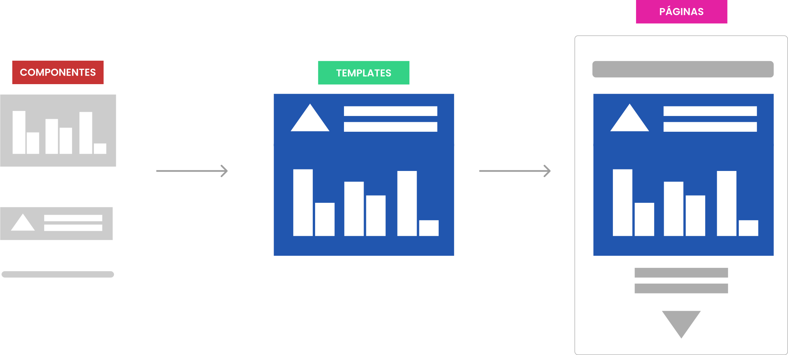
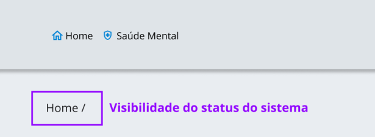
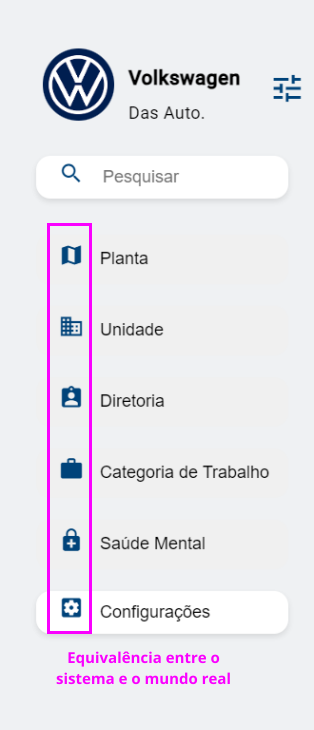
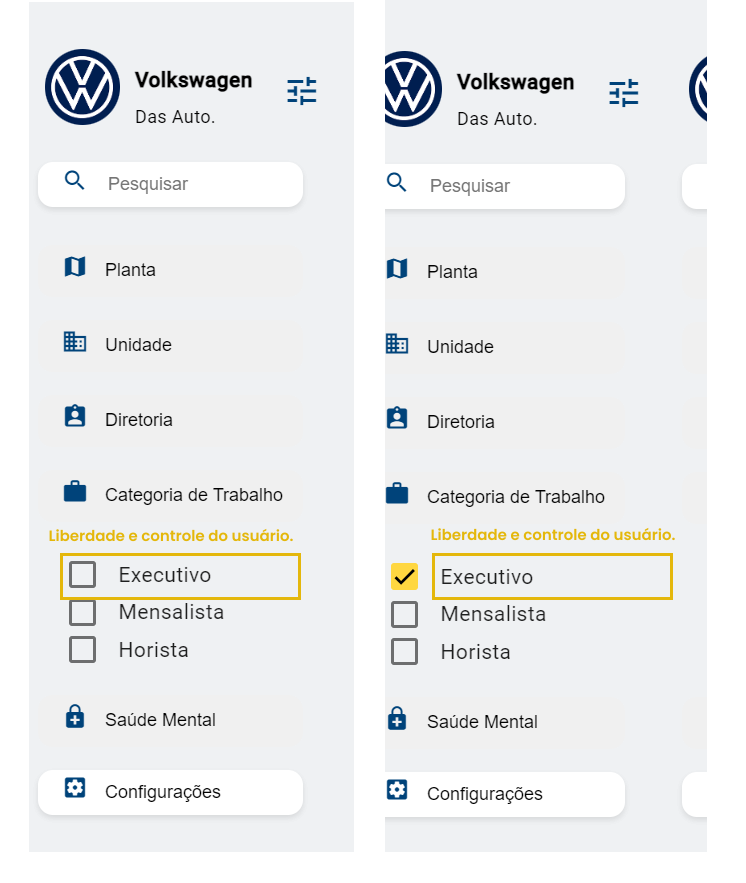
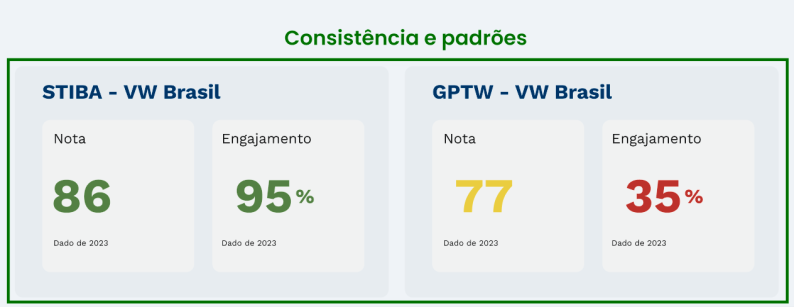
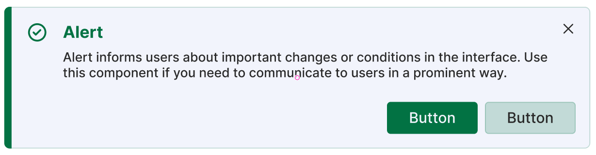
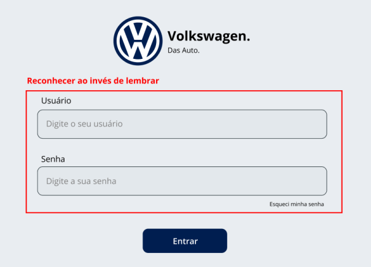
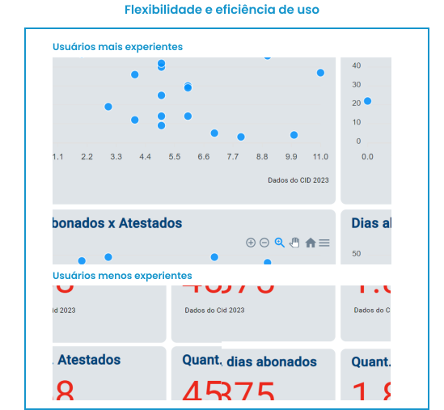
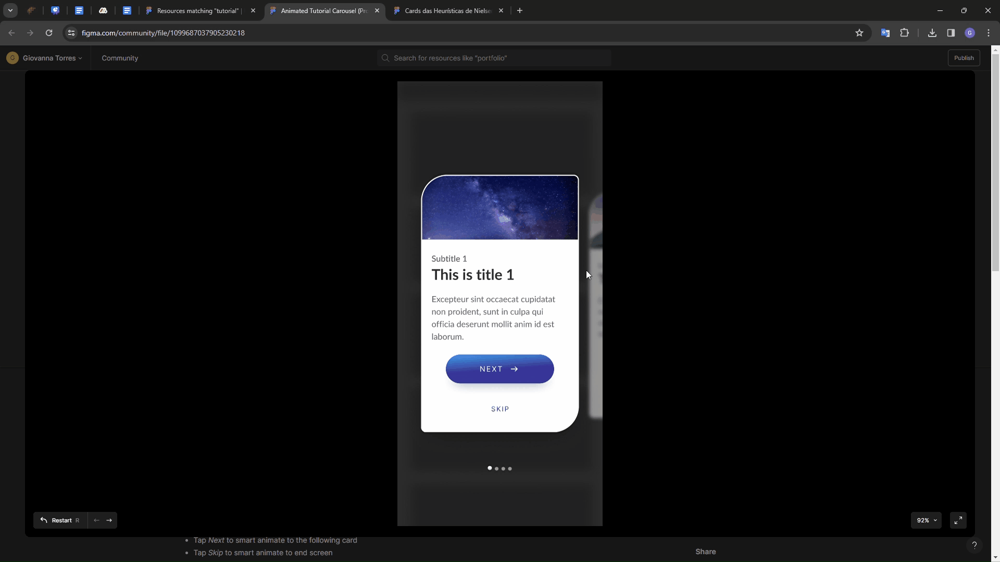

# Sumário

[1. Introdução](#c1)

[2. Heurísticas](#c2)

[3. Framework](#c3)

[4. Análise das heurísticas](#c4)

[5. Avaliação Detalhada dos problemas](#c5)

[6. Referências](#c6)

 

#  1. Introdução

Neste documento, apresenta-se as heurísticas utilizadas que norteiam o desenvolvimento da aplicação utilizando o framework Angular. Ao criar interfaces que atendam às necessidades das personas de Recursos Humanos (RH) e CEO, priorizamos os recursos que possibilitam um acompanhamento da saúde mental dos funcionários mais informativo.

As heurísticas selecionadas fornecem uma estrutura para avaliar a usabilidade e a eficácia do design, garantindo que cada elemento contribua para uma experiência positiva e centrada no usuário. Nesse sentido, destacamos as heurísticas que mais se adaptam ao contexto de análise, visando não apenas a eficiência operacional, mas também o bem-estar e a satisfação dos usuários.

Ao longo deste documento, abordaremos cada uma das heurísticas identificadas, fornecendo exemplos específicos sobre como elas foram aplicadas no design para promover a usabilidade, a acessibilidade e o acompanhamento da saúde mental dos funcionários. Este processo é fundamental para aprimorar a experiência do usuário e garantir que a aplicação atenda às expectativas e necessidades dos stakeholders.

## 1.1 Link do Figma

Visto que o sistema ainda só pode ser acessado via localhost, encaminho o link do mockup no figma para análise, se necessário. 

https://www.figma.com/file/X7zrBZLA2KC8Ot9aL15BCg/Wireframe?type=design&node-id=0%3A1&mode=design&t=XB5OS4NpIhe0Tc2N-1 

#  2. Heurísticas

As heurísticas de usabilidade são princípios estabelecidos para avaliar e melhorar a qualidade da experiência do usuário em interfaces digitais. Elas representam diretrizes que ajudam os designers e desenvolvedores a criar sistemas mais eficientes, intuitivos e agradáveis de usar. Ao segui-las, é possível identificar problemas de usabilidade em estágios iniciais do processo, economizando tempo e recursos ao longo do desenvolvimento. Apresenta-se abaixo a explicação das 10 heurísticas de Nielsen, seguidas de um exemplo relacionado ao projeto do dashboard:

 

**Figura 1:** Heurísticas de Nielsen  
**Fonte:** Autores

 

#  3. Framework 

Para a construção do dashboard, utilizamos o framework Angular, uma plataforma de desenvolvimento web baseada em TypeScript que oferece uma estrutura robusta e escalável para o desenvolvimento de aplicativos web de grande porte, sendo uma de suas principais vantagens a capacidade de dividir a aplicação em componentes reutilizáveis.

Os componentes são blocos de construção fundamentais no Angular e encapsulam a lógica e a interface do usuário de forma independente, permitindo a reutilização e modularidade do código. Isso facilita a manutenção e escalabilidade do projeto, uma vez que cada parte do aplicativo é tratada como uma entidade isolada. Ao adotar uma abordagem baseada em componentes, conseguimos garantir a consistência e a modularidade da interface do usuário, o que contribui para várias heurísticas, incluindo consistência e padrões de interface reconhecíveis.

Além do Angular, também utilizamos a biblioteca Material UI para a construção da interface do usuário. Material UI é uma implementação de referência do Material Design, um conjunto de diretrizes de design criado pelo Google que fornece componentes prontos para uso,  o que facilita a criação de uma interface consistente. Além disso, a utilização dessa biblioteca promove uma interface visual limpa e intuitiva, facilitando a compreensão e a navegação do usuário. Isso está alinhado com heurísticas relacionadas à visibilidade do sistema e ao reconhecimento ao invés de memorização.

Portanto, ao utilizar o framework Angular e a biblioteca Material UI, conseguimos desenvolver um dashboard que não apenas atende aos requisitos funcionais, mas também oferece uma experiência de usuário intuitiva e consistente.

**Figura 2 :** Estrutura de componentes  
**Fonte:** Autores

 

#  4. Análise das heurísticas

Abaixo está a imagem do dashboard, demonstrando o uso adequado da primeira heurística de Nielsen, "Visibilidade do Status do Sistema". Esta imagem ilustra a navegação do usuário, fornecendo feedback claro sobre sua localização atual na plataforma.

 

**Figura 3 :** Primeira Heurística  
**Fonte:** Autores
 

A seguir, a imagem do dashboard ilustra o uso da segunda heurística de Nielsen, "Equivalência entre o Sistema e o Mundo Real". Observa-se a presença de ícones na barra de navegação que não apenas são consistentes com aqueles encontrados em outros sistemas, mas também refletem objetos do mundo real, como o ícone de configurações representado pela engrenagem, amplamente utilizado.

 

**Figura 4 :** Segunda Heurística  
**Fonte:** Autores
 

Abaixo está a imagem do dashboard que exemplifica o uso da terceira heurística de Nielsen, "Liberdade e Controle do Usuário". Nos filtros disponíveis, os usuários têm a capacidade de selecionar opções de um checklist, o que resulta na alteração dos números nos gráficos conforme o filtro escolhido. Além disso, ao desmarcar a seleção, os dados retornam ao estado original.

 

**Figura 5 :** Terceira Heurística  
**Fonte:** Autores
 

A seguir, a imagem evidencia a aplicação da quarta heurística de Nielsen, "Consistência e Padrões". Neste contexto, as telas mantêm um padrão uniforme de cores para indicar o status ao usuário. Além disso, os cards são dispostos com um layout uniforme, contribuindo para uma experiência consistente e intuitiva.

 

**Figura 6 :** Quarta Heurística  
**Fonte:** Autores
 

A imagem a seguir ilustra a quinta heurística de Nielsen, 'Prevenção de Erros', pela criação de KAHA no Figma Community. Até o momento, a confirmação de ação para o usuário ainda não foi implementada, porém, está prevista para as próximas sprints. Um exemplo dessa implementação pode ser visualizado no card abaixo, o qual oferece uma opção de confirmação antes uma mudança no sistema, que no nosso caso poderia ser uma confirmação de liberação de acesso em massa dos colaboradores.

 

**Figura 7 :** Quinta Heurística  
**Fonte:** KAHA - Figma Community (https://www.figma.com/community/file/1193125363704678153)
 

Abaixo está a imagem do dashboard demonstrando a aplicação da sexta heurística de Nielsen, 'Reconhecimento em vez de Lembrança'. No exemplo da página de login, observamos que o formato de inserção de dados pode ser compreendido de forma clara pelo usuário, além da opção 'Esqueci minha senha', que permite reconhecer facilmente a ação a ser tomada sem que seja necessário lembrar.

 

**Figura 8 :** Sexta Heurística  
**Fonte:** Autores
 

A seguir, a imagem evidencia a aplicação da sétima heurística de Nielsen, 'Flexibilidade e Eficiência de Uso'. Dentro do dashboard, são apresentados gráficos complexos de entendimento, como o de bolha. No entanto, para minimizar qualquer desentendimento por parte de usuários menos experientes, as mesmas informações são também contempladas em cards, com numeração e explicação mais simples, proporcionando flexibilidade e consistência no uso da plataforma.

 

**Figura 9 :** Sétima Heurística  
**Fonte:** Autores
 

Abaixo está imagem exemplificando o uso da oitava heurística de Nielsen, 'Estética e Design Minimalista'. Os elementos apresentam cores de fundo neutras, enquanto os ícones e logotipos seguem um padrão de cor azul consistente. Além disso, os textos no dashboard são curtos, facilitando o entendimento pelo usuário.

 

**Figura 10 :** Oitava Heurística  
**Fonte:** Autores
 

A imagem abaixo exemplifica a aplicação da nona heurística de Nielsen, "Reconhecer, diagnosticar e recuperar erros". Embora ainda não esteja implementada, está planejada para futuras sprints. Um exemplo específico é a possível ocorrência do código de erro 404, que pode ser retornado caso haja uma tentativa de acessar uma página ou recurso que não esteja disponível ou não foi encontrada no sistema.

 

**Figura 11 :** Nona Heurística  
**Fonte:** Storage Google API (https://storage.googleapis.com/support-forums-api/attachment/thread-9897102-6830413425876385539.JPG) 
 

Apresenta-se abaixo um gif de exemplificação reflete o uso adequado da décima heurística de Nielsen, "Ajuda e documentação". Até o momento, o tutorial não foi implementado, porém, está previsto para as próximas sprint. Um exemplo dessa implementação é um recurso informativo com as ações básicas do sistema para auxiliar os usuários em relação a plataforma, como visto na criação do Jeremy Abrams no Figma Community.

 

**Figura 12 :** Décima Heurística  
**Fonte:** Jeremy Abrams - Figma Community (https://www.figma.com/community/file/1099687037905230218)
 

#  5. Avaliação Detalhada dos problemas 

## Análise 1 - Grupo 4 

https://docs.google.com/spreadsheets/d/1a7ANkZHoBAXvvxf1bfColDqVI_roVFs1golfqBd4KBw/edit?usp=sharing

## Análise 2 - Grupo 5 

https://docs.google.com/spreadsheets/d/1yxqbbUUMd-3HZimAHP64zcNfpZ0MX7D2-xF4Xqlwyyw/edit?usp=sharing

## Análise Heurística - Nova avaliação

Aplicou-se uma nova avaliação com o Jonathan Alves, calouro do 1º ano que não estava familiarizado com o projeto nem com as telas e ofereceu suas percepções para enriquecer a avaliação do nosso dashboard.

https://docs.google.com/spreadsheets/d/1wsPIuGCyRFcuKOIEGev5EXQ8TvvZx1bpFsnhGoaqkK8/edit?usp=sharing

Fazendo uma comparação das notas das análises feitas pelos grupos 4 e 5 durante a sprint 2 com a nova avaliação realizada pelo calouro na sprint 3, temos a seguinte nota:

- Nota média dos grupos 4 e 5 na sprint 2: 154/250
- Nota atual na sprint 3: 181/250

Com base nisso, é evidente que houve uma melhoria ao aplicar as heurísticas no dashboard. No entanto, ainda existem áreas que precisam de aprimoramento, conforme detalhado no próximo tópico.

## Problemas Heurísticos

A tabela a seguir foi construída com base nos feedbacks dos Grupos 4 e 5, coletados durante a aula "Usabilidade e Heurística para Dashboards" de UX. Cada ponto levantado foi adaptado e relacionado a uma heurística de Nielsen, visando implementar as sugestões específicas nas próximas sprints, mais precisamente na Sprint 4 ou 5. Essa abordagem permite uma integração eficiente das necessidades dos usuários com os princípios de usabilidade estabelecidos, promovendo melhorias no design e na experiência geral do sistema. 
 

**Observação:** Na coluna "Problema" os tópicos foram retirados das análises realizadas pelos grupos nas planilhas do sheets anexadas abaixo. 

 

| Heurística | Nome da Heurística | Problema | Status | Solução | Sprint de Realização |
|:-----------:|:-------------------:|:--------:|:------:|:-------:|:-------------------:|
| 1 | Visibilidade do status do sistema | "Falta barra de pesquisa evidente na versão mobile" | Moderado | Adicionar uma lupa que expande ao ser clicada | Sprint 5 |
| 2 | Correspondência entre o sistema e o mundo real | "Linguagem das legendas pouco familiar" | Menor | Adicionar títulos e legendas mais claros ao usuário | Sprint 4 |
| 3 | Controle e liberdade do usuário | "Não há possibilidade de customização da interface" | Moderado | Adicionar opção de filtro específico em cada gráfico | Sprint 5 |
| 4 | Consistência e padrões | "Falta adicionar legenda nos gráficos" | Crítico | Adicionar legenda explicativa nos gráficos faltantes | Sprint 4 |
| 5 | Prevenção de erros | "Usuário não possui notificação de atualização dos dados" | Crítico | Adicionar feedbacks com a biblioteca SweetAlert que comporta o framework Angular | Sprint 4 |
| 6 | Reconhecimento em vez de lembrança | "Ícones utilizados não fazem referência direta ao significado com o mundo real" | Menor | Adicionar ícones com uma ligação mais forte com aspectos cotidianos | Sprint 4 |
| 7 | Flexibilidade e eficiência de uso | "Alguns gráficos apresentam dificuldade de entendimento, não abrangendo pessoas com pouca experiência" | Moderado | Refatorar os gráficos de linha do dashboard geral | Sprint 4 |
| 8 | Estética e design minimalista | "Design não tão minimalista" | Menor | Pensar nos cards das páginas em cores mais neutras | Sprint 4 |
| 9 | Reconhecimento, diagnóstico e recuperação de erros | "Não há reconhecimento de erro pelo usuário" | Crítico | Pensar em adicionar erros do sistema apresentando o resultado com a biblioteca SweetAlert que aceita o framework Angular | Sprint 5 |
| 10 | Ajuda e documentação | "Não possui tutorial no dashboard" | Crítico | Adicionar informativo explicando ações básicas do sistema | Sprint 5 |

 

**Tabela 1 :** Avaliação detalhada  
**Fonte:** Autores

#  6. Referências

MOMA, Gabriel. 10 heurísticas de Nielsen para o design de interface, UX Collective BR. 02 de Agosto de 2017. Disponível em: https://brasil.uxdesign.cc/10-heur%C3%ADsticas-de-nielsen-para-o-design-de-interface-58d782821840. Acesso em: 13 de Março de 2023.