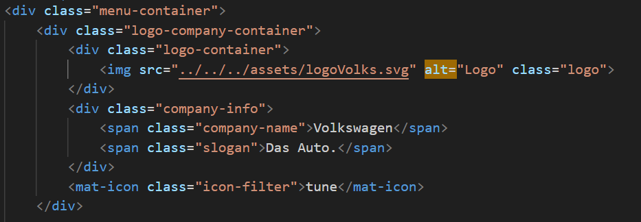
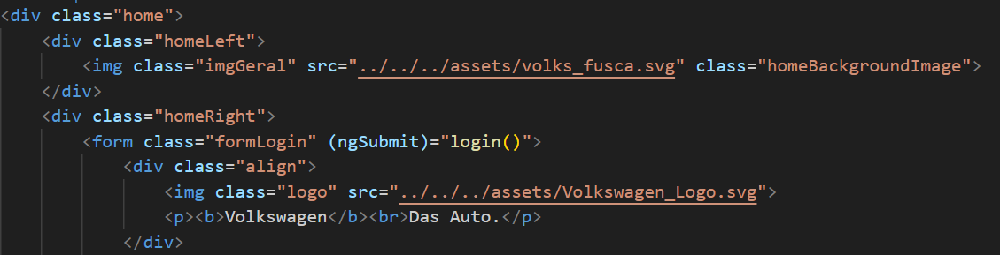
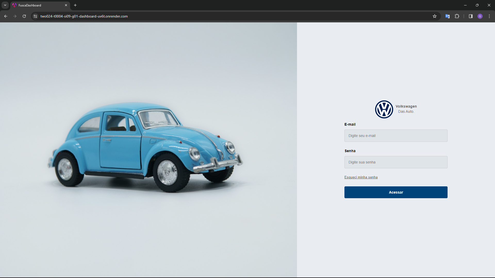
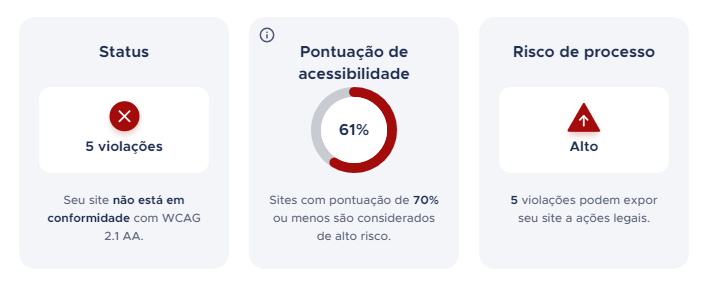

# 1. Relatório de Testes de Usabilidade

Teste de usabilidade é uma técnica utilizada no design para avaliar a facilidade de uso de um sistema interativo por parte dos usuários. O principal objetivo é identificar problemas de usabilidade que os usuários podem enfrentar ao interagir com o produto e fornecer insights para melhorias. Durante um teste de usabilidade, as métricas comuns utilizadas incluem eficácia (se os usuários conseguiram realizar as tarefas com sucesso), eficiência (quanto tempo e esforço os usuários precisaram para completar as tarefas) e satisfação do usuário (como os usuários se sentem sobre a experiência geral). Com base nos resultados, os designers e desenvolvedores podem fazer ajustes no produto para melhorar a experiência. Isso pode incluir mudanças na interface, fluxo de trabalho, organização de informações e outras melhorias destinadas a tornar o produto mais fácil e agradável de usar.

## 1.1 Tipos de testes 

Abaixo, apresentam-se os tipos de teste de usabilidade que podem ser empregados em um sistema. É importante notar que esses tipos de teste podem ser combinados para obter uma compreensão mais abrangente da usabilidade. A escolha do tipo de teste depende dos objetivos específicos do projeto, das restrições de tempo e recursos, bem como da natureza do público-alvo. Ao combinar múltiplos tipos de teste, pode-se obter insights mais precisos, permitindo refinamentos na interface e na experiência do usuário.

### 1.1.1 Teste de usabilidade moderado vs. não moderado

- **Teste de Usabilidade Moderado:** Neste teste, um moderador está presente para guiar os participantes e observar suas interações com o produto. O moderador pode fazer perguntas, fornecer instruções e registrar observações sobre o comportamento do usuário.
- **Teste de Usabilidade Não Moderado:** Neste caso, os participantes realizam o teste sem a presença de um moderador. Geralmente são instruídos por um conjunto de tarefas e orientações pré-registradas. Os dados são coletados automaticamente pelo sistema, como registros de interações e respostas a perguntas.

### 1.1.2 Testes de usabilidade remotos vs. testes presenciais

- **Testes de Usabilidade Remotos:** Conduzidos com participantes remotos, podem ser moderados ou não moderados. Geralmente por meio de ferramentas online, como videoconferência ou compartilhamento de tela.
- **Testes de Usabilidade Presenciais:** Neste caso, os participantes estão fisicamente presentes em um local designado para realizar o teste. Isso permite uma interação mais direta, facilitando observações e uma comunicação mais fluida.

### 1.1.3 Teste exploratório vs. avaliação vs. teste comparativo

- **Teste Exploratório:** Utilizado para explorar a interface e descobrir possíveis problemas de usabilidade. Os participantes são encorajados a navegar livremente pelo produto e fornecer feedback espontâneo.
- **Avaliação:** Neste tipo, os participantes são solicitados a realizar tarefas específicas dentro do produto. O objetivo é avaliar a facilidade com que os participantes conseguem completar essas tarefas e identificar possíveis problemas.
- **Teste Comparativo:** Envolve comparar duas ou mais versões de um produto. Os participantes interagem com cada versão e fornecem feedback sobre suas preferências, eficácia e experiência geral.

### 1.1.4 Teste heurístico vc. teste discursivo

- **Teste Heurístico:** Neste teste, os avaliadores aplicam heurísticas para identificar problemas de design. As heurísticas são princípios gerais de design que podem ajudar a identificar problemas comuns de usabilidade.
- **Teste Discursivo:** Neste caso, os participantes são solicitados a pensar em voz alta enquanto interagem com o produto. Isso permite que os avaliadores entendam o raciocínio por trás das ações dos participantes e identifiquem possíveis dificuldades ou confusões durante o processo.

## 1.2 Testes - Vantagens e Desvantagens 

  

| Tipo de Teste  |Vantagens    | Desvantagens   |
|--------------------------------|-----------------------------------------------------------------------------------------------------------------------------------------------------------------------------------------------------------------------------------------------|----------------------------------------------------------------------------------------------------------------------------------------------------------------------------------------------------------------------------------------------------------------------------------------------|
| Moderado                       | - Permite observações detalhadas do comportamento do usuário.   - Possibilita fazer perguntas adicionais.   - Facilita a criação de rapport entre o moderador e os participantes.                     | - Pode ser mais caro e demorado devido à necessidade de um moderador.   - A presença do moderador pode influenciar o comportamento dos participantes.   - Pode ser difícil encontrar participantes disponíveis para sessões presenciais.                                                     |
| Não Moderado (Remoto)         | - Mais econômico e rápido, pois não requer a presença de um moderador.   - Maior flexibilidade de horários para os participantes.   - Pode atingir uma amostra mais diversificada de participantes geograficamente dispersos.                    | - Menos controle sobre o ambiente de teste, resultando em menor capacidade de observação.   - Dificuldade em fornecer suporte imediato aos participantes em caso de problemas.   - Pode ser necessário investir em ferramentas e tecnologia para facilitar a execução do teste remoto.                   |
| Presencial                     | - Permite uma interação mais direta e imediata entre moderador e participantes.   - Facilita a observação detalhada das expressões faciais e reações dos participantes.   - Melhor para testar produtos ou cenários que requerem interação física.         | - Pode ser mais caro e logísticamente complicado devido à necessidade de um local físico.   - Limitado à disponibilidade geográfica dos participantes.   - Pode ser intimidante para alguns participantes, afetando sua experiência de teste.                                       |
| Remoto                         | - Mais conveniente e econômico, pois elimina a necessidade de um local físico.   - Permite alcançar participantes de diversas localizações geográficas.   - Menor probabilidade de influenciar o comportamento do participante devido à menor presença do moderador. | - Menos controle sobre o ambiente de teste, especialmente em relação a fatores externos que podem afetar a experiência do usuário.   - Dificuldade em estabelecer uma conexão emocional com os participantes, o que pode limitar a profundidade do feedback fornecido. |
| Exploratório                   | - Facilita a identificação de problemas inesperados de usabilidade.   - Encoraja a criatividade e a exploração livre por parte dos participantes.   - Pode revelar insights únicos que não seriam descobertos em outros tipos de teste.                     | - Menos estruturado, o que pode dificultar a comparação e a análise sistemática dos resultados.   - Pode ser difícil de controlar o tempo e o foco dos participantes, levando a sessões de teste menos produtivas.                                                                  |
| Avaliação                      | - Fornecem resultados concretos sobre a capacidade dos participantes de realizar tarefas específicas.   - Permitem uma comparação direta entre diferentes versões ou designs alternativos.   - São mais fáceis de administrar e analisar do que testes exploratórios.           | - Podem não capturar completamente a experiência do usuário, já que se concentram principalmente na conclusão de tarefas específicas.   - Menos eficazes para identificar problemas de usabilidade que não estão diretamente relacionados às tarefas definidas.                |
| Comparativo                    | - Permite uma comparação direta entre duas ou mais versões do produto.   - Ajuda a identificar diferenças de usabilidade entre os designs.   - Facilita a tomada de decisão informada sobre qual design ou solução adotar.                    | - Pode ser mais complexo de administrar e analisar devido à necessidade de coordenar múltiplas versões ou designs alternativos.   - Requer uma amostra maior de participantes para detectar diferenças entre os designs comparados.           |
| Heurístico                     | - Identifica problemas de usabilidade com base em princípios estabelecidos de design de interface.   - É rápido e eficiente, permitindo a identificação de problemas com um pequeno grupo de especialistas.   - Ajuda a priorizar e categorizar os problemas encontrados para facilitar a resolução. | - Não substitui o feedback do usuário real, já que se baseia em princípios de design em vez de testes empíricos com usuários reais.   - Pode não identificar todos os problemas de usabilidade, especialmente aqueles que são específicos do contexto ou do público-alvo.     |
| Discursivo                     | - Fornece insights sobre o processo mental dos usuários durante a interação com o produto.   - Ajuda a identificar pontos de confusão, incerteza ou frustração do usuário em tempo real.   - Pode ser combinado com outros tipos de teste para obter uma visão mais abrangente da experiência. | - Pode ser difícil para os participantes expressarem seus pensamentos de forma verbal enquanto executam tarefas, o que pode afetar a precisão e a utilidade do feedback fornecido.   - Pode aumentar a carga cognitiva dos participantes, afetando negativamente o desempenho e a experiência do teste.         |

 

Tabela 1: Vantagens e Desvantagens de testes de usabilidade  
Fonte: Autoria Própria

## 1.3 Escolha do teste 

Optou-se por uma combinação de testes não moderados, remotos, de avaliação e heurísticos para avaliar as funcionalidades específicas do sistema. Além disso, uma análise heurística preliminar foi realizada anteriormente com outros grupos da sala, o que nos permite validar se as mudanças implementadas contribuíram para uma melhor experiência durante os testes. Há um tempo restrito para entrar em contato com as personas e realizar os testes, o que torna a opção remota mais viável, além de permitir alcançar uma amostra diversificada de participantes, ampliando a representatividade dos resultados. Ao escolher esta combinação espera-se identificar possíveis problemas específicos, conseguindo uma avaliação abrangente e informada.

## 1.4 Participantes 

Para garantir que os testes fossem representativos e centrados nas necessidades dos usuários finais, baseamos a seleção dos participantes nas personas da solução, que incluem profissionais de recursos humanos (RH) e médicos, com foco no contexto de saúde mental dos colaboradores. 

Dado o caráter mais qualitativo dos testes, nos quais aplicam-se as mesmas etapas de fluxo para todos os participantes, os testes foram realizados com um grupo de cinco pessoas. Esta abordagem está alinhada com a teoria que diz que com apenas cinco usuários, é possível encontrar cerca de 85% dos problemas de usabilidade em um sistema. Embora o tamanho da amostra seja relativamente pequeno, acreditamos que será suficiente para identificar as principais questões de usabilidade e obter insights sobre a experiência do usuário.

## 1.5 Ferramentas Utilizadas 

As ferramentas empregadas para conduzir o teste incluem o envio do link do sistema em produção no render.com para os usuários realizarem os testes, o uso do Meet para acompanhar e fornecer instruções durante as atividades online, e o Google Sheets para registrar e documentar as observações feitas durante os testes.

 

## 1.6 Aplicação dos testes 

Os testes foram realizados em um ambiente controlado, onde os participantes interagiram com a aplicação conforme instruções fornecidas. Foi utilizada uma abordagem de observação direta, sem influenciar os participantes, enquanto realizavam as tarefas.

Para cada participante, foram registradas as ações realizadas durante o teste, junto com a avaliação de sucesso ou não conclusão e uma descrição sobre o desempenho. Este registro permite uma análise do comportamento dos usuários e a identificação de pontos específicos de dificuldade.

### 1.6.1 Resultados dos testes

Apresenta-se abaixo o link das anotações realizadas durante as interações :

<a href="./Teste-de-acessibilidade.pdf">Tabulação de Testes de Acessibilidade</a>

#### 1.6.1.1 Teste 1

Com base no feedback dos testes de acessibilidade, os usuários tiveram dificuldade em localizar o card relacionado ao Zenklub devido à falta de especificação no nome do gráfico e à falta de recursos visuais que diferenciam os gráficos gerais dos relacionados ao Zenklub. Além disso, havia apenas um ícone dentro do gráfico para identificar sua associação ao Zenklub.

Para melhorar a acessibilidade e a usabilidade do sistema, segue abaixo algumas soluções:

Alterar o nome do gráfico para uma referência clara ao Zenklub, onde os usuários possam identificar facilmente os relacionados a plataforma.
Utilizar recursos visuais, como cores e ícones específicos, para diferenciá-los dos gerais. Por exemplo: Alterar os gráficos para roxo, visto que é a cor da plataforma.
Separar a página por setores, especificando o título em ‘Dados Gerais’ e ‘Dados do Zenklub’. 

#### 1.6.1.2 Teste 2

No segundo teste os usuários tiveram dificuldade em relacionar a sigla ao nome da cidade. Uma sugestão para resolver esse problema seria:

- Ao exibir a sigla da cidade, incluir o nome completo da cidade, seja ao lado da sigla ou em uma dica de ferramenta (tooltip) que aparece quando o usuário passa o mouse sobre a sigla.

#### 1.6.1.3 Teste 3

O teste foi realizado com sucesso pelos usuários, logo nenhum apontamento foi registrado.

#### 1.6.1.4 Teste 4

O teste foi realizado com sucesso pelos usuários, logo nenhum apontamento foi registrado.

#### 1.6.1.5 Teste 5

No quinto teste os usuários tiveram dificuldade em filtrar um gráfico por uma variável específica. Abaixo seguem sugestões para tornar o processo mais intuitivo:

- Em vez de depender apenas do clique na legenda do gráfico para filtrar os dados, fornecer controles de filtro claros e visíveis, como menus suspensos ou caixas de seleção.
- Ao interagir com os controles de filtro, fornecer feedback imediato para indicar que a ação foi realizada com sucesso, como um pop-up. 

 

# 2. Relatório de Acessibilidade

## 2.1 Checklist de Acessibilidade

| Critério | Descrição | Cumprimento | Observações |
|---|---|---|---|
| 1.3.1 Sequência com significado | As informações e elementos da interface do usuário devem ser apresentados de forma que preservem o significado quando apresentados em diferentes ordens. | **[A] Cumpre** | O site apresenta uma estrutura de organização de informações de modo granular, ou seja, seguindo uma ordem lógica, iniciando dos dados gerais para os específicos. |
| 2.4.2 Página com título | Cada página do site deve ter um título que identifique de forma clara e concisa o conteúdo da página. | **[A] Cumpre** | Todas as páginas possuem título para identificação do conteúdo, seja referente às pesquisas do GTWP/STIBA, quanto relacionados à saúde mental, do ZenKlub. |
| 3.3.2 Rótulos e instruções | Todos os formulários e campos de entrada devem ter rótulos claros e concisos que identifiquem o que precisa ser inserido. | **[A] Cumpre** |  O formulário principal da plataforma é o de login, onde ambos os campos apresentam instruções de preenchimento. |
| 4.1.2 Nome, função e valor | Todos os elementos de interface do usuário, como botões, links e imagens, devem ter um nome, função e valor que possam ser acessados por tecnologias assistivas. | **[A] Cumpre Parcialmente** | Os botões e legendas da aplicação cumprem parcialmente com o critério, visto que nem todos possuem o "aria-label" em seu código, sendo necessário a revisão e inclusão dele nos tópicos faltantes. |

 

Tabela 2: Checklist de acessibilidade  
Fonte: Autoria Própria

**Observações gerais:**

* É importante ressaltar que a acessibilidade é um processo contínuo e que é recomendável realizar avaliações regulares para identificar e corrigir possíveis barreiras.

## 2.2 Análise Detalhada

O não cumprimento do critério 4.1.2 Nome, função e valor do WCAG, pode impactar na acessibilidade do site para usuários com deficiências que dependem de tecnologias assistivas, como leitores de tela. Este critério exige que todos os elementos de interface do usuário, como botões, links e imagens, tenham um nome, função e valor que possam ser acessados por essas tecnologias. Quando este critério não é atendido, os usuários podem enfrentar diversas dificuldades, como:

- Sem nomes e funções adequadas atribuídas aos elementos, os usuários podem ter dificuldade em entender a estrutura e a função do site.
- A falta de atribuição de valores aos elementos interativos, como botões, pode impedir que os usuários entendam como interagir com o site. Por exemplo, um botão sem um rótulo claro pode não ser reconhecido como um elemento clicável.

No momento, embora o atributo aria-label tenha sido implementado em alguns elementos, sua aplicação ainda não abrange todo o site. Está planejada uma revisão completa e a adição desse atributo em todos os elementos durante a última sprint. Segue abaixo duas imagens representando o código com e sem a implementação adequada do atributo aria-label:

Figura 1: Código com "alt-label"  
Fonte: Autoria Própria

 

Figura 2: Código sem "alt-label"  
Fonte: Autoria Própria

## 2.3 Ferramentas e Testes Adicionais

Devido ao fato do sistema estar atualmente passando por testes e revisões finais em produção, a avaliação de acessibilidade foi restrita à página de login. Isso se deve ao fato de que o "Free Accessibility Test" não aceita link ou alguma outra forma de acesso direto que tenha encaminhamento, como "/dash-geral". 

### 2.3.1 USERWAY - Free Accessibility Test

O UserWay é uma plataforma que oferece soluções de acessibilidade para websites. Ele fornece ferramentas e recursos para tornar os sites mais acessíveis para pessoas com deficiências, tendo o objetivo de garantir que todos os usuários, independentemente de suas habilidades ou deficiências, possam acessar e interagir com o conteúdo. A tela escaneada foi a página de login apresentada abaixo:

Figura 3: Página de Login  
Fonte: Autoria Própria

Uma das ferramentas utilizadas pelo Userway é um relatório que fornece aos usuários uma visão geral do estado da acessibilidade de um site específico, incluindo:

- **Status:** se refere ao estado geral da acessibilidade do site, indicando se ele está em conformidade com as diretrizes de acessibilidade ou se existem áreas que precisam de melhorias.

- **Pontuação de acessibilidade:** indica o quão acessível é o site de acordo com os padrões e diretrizes estabelecidos, como as Web Content Accessibility Guidelines (WCAG). 

- **Risco de processo:** se refere ao potencial risco legal que o site enfrenta devido à falta de conformidade com as leis de acessibilidade. 

Segue abaixo o relatório geral da página de login:

Figura 4: Relatório página de login  
Fonte: Autoria Própria

#### 2.3.1.1 Problemas de acessibilidade (POR FUNÇÃO)

| Falhas                                        | Descrição                                                                                                                                                                                                                                  | Ação recomendada                                                                                                                                                                                                                                                                                                                                                                                                                                               | Grupos atingidos                                       |
|-----------------------------------------------|--------------------------------------------------------------------------------------------------------------------------------------------------------------------------------------------------------------------------------------------|---------------------------------------------------------------------------------------------------------------------------------------------------------------------------------------------------------------------------------------------------------------------------------------------------------------------------------------------------------------------------------------------------------------------------------------------------------------|-------------------------------------------------------|
| A imagem não possui um atributo 'alt' obrigatório | Verifica se cada imagem tem um  atributo 'alt' com uma descrição suficientemente clara e concisa para transmitir o significado da imagem aos usuários com deficiência visual que dependem de leitores de tela e outras tecnologias assistivas. | Adicione um atributo 'alt' com uma descrição clara e concisa. Por exemplo: `<alt='Um foguete decola da plataforma de lançamento'>`. Se a imagem for puramente decorativa ou se uma descrição de texto for redundante com o texto próximo, adicione um campo vazio e um atributo com valor de verdadeiro. Por exemplo: ``. | Cegos, mobilidade, baixa visão                      |
| O campo do formulário não possui um elemento   <"label">   | Verifica se cada campo do formulário possui um associado/<rótulo> elemento ou texto descritivo. Sem rotulagem ou descrição, os usuários que dependem de leitores de tela ou outras tecnologias não podem determinar a entrada solicitada.  | Adicione um/<rótulo> elemento que descreve o campo do formulário. Para associar o <rótulo> com o campo de formulário descrito, adicione um/para atribuir ao/<rótulo>| que faz referência ao/eu ia do campo do formulário. Por exemplo:<label for="fname'>Nome:</label><input type="text' id='fname'>|. Se adicionar um associado <rótulo> é impossível, adicione uma descrição (rótulo ária atributo ao campo do formulário. Por exemplo: <"input type='text' aria-label='Nome'">|. Se um elemento próximo puder servir para descrever um campo de formulário, adicione um aria-rotulado por atributo ao campo do formulário que faz referência ao/eu ia atributo do elemento descritivo. | Cegos, Surdo cego                                    |

 
Tabela 3: Critérios por função  
Fonte: Autoria Própria
 

 

#### 2.3.1.2 Problemas de acessibilidade (CRITÉRIOS WCAG)

| Critérios WCAG             | Falhas                                    | Descrição                                                                                                                                                                                                                                                                                                      | Ação recomendada                                                                                                                                                                                                                                                                                                                                                                                                                    |
|-----------------------------|-------------------------------------------|--------------------------------------------------------------------------------------------------------------------------------------------------------------------------------------------------------------------------------------------------------------------------------------------------------------------------------------------------------------------------------|-----------------------------------------------------------------------------------------------------------------------------------------------------------------------------------------------------------------------------------------------------------------------------------------------------------------------------------------------------------------------------------------------------------------------------------|
| Conteúdo não textual       | A imagem não possui um atributo 'alt' obrigatório | Verifica se cada imagem tem um atributo com uma descrição clara e concisa para transmitir o significado da imagem aos usuários com deficiência visual que dependem de leitores de tela e outras tecnologias assistivas.                                                                                                                                                                                                         | Adicione um atributo com uma descrição clara e concisa. Por exemplo: `<alt='Um foguete decola da plataforma de lançamento'>`. Se a imagem for puramente decorativa ou se uma descrição de texto for redundante com o texto próximo, adicione um campo vazio e um atributo com valor verdadeiro. Por exemplo: ``. |                                                                                                                                                                                                                                        |
| Informações e Relacionamentos | O elemento não possui marcação semântica | Palavras ou frases destinadas a ter peso ou ênfase semântica devem ser marcadas com <forte> ou/<em> (ênfase) elementos, não com/<b> (negrito) ou/<eu> itálico). Quando se pretende um tratamento semanticamente especial, os elementos semânticos mudarão tanto a aparência visual quanto a entonação das palavras quando faladas por um leitor de tela. O/<b>e/<eu> Jos elementos mudarão apenas a aparência visual, não a entonação falada.  | Mudar <b> para <forte> e <eu> para <em>, se o texto afetado pretende ter peso ou ênfase semântica.  |                                                                                                                                                                                                                                                                                                                                              
| Títulos e Rótulos           | O compo do formulário não possui um elemento <"label"> | Verifica se cada campo do formulário possui um elemento <label> ou texto descritivo associado. Sem rótulo ou descrição, os usuários que dependem de leitores de tela ou outras tecnologias assistivas não podem determinar a entrada solicitada.                                                                                                                                 | Adicione um elemento <label> que descreva o campo do formulário. Para associar o <label> com o campo de formulário descrito, adicione um atributo "for" que faça referência ao ID do campo do formulário. Por exemplo: `<label for="fname">Nome:</label><input type="text" id="fname">`. Se adicionar um <label> é impossível, adicione uma descrição com o atributo aria-label ao campo do formulário. Por exemplo: `<input type='text' aria-label='Nome'>`. Se um elemento próximo puder servir para descrever um campo de formulário, adicione um atributo aria-labelledby ao campo do formulário que faça referência ao ID do elemento descritivo. |

 
Tabela 4: Critérios por WCAG  
Fonte: Autoria Própria

 

## 2.4 Link do relatório

https://userway.org/accessibility-checker/?url=two024-t0004-si09-g01-dashboard-uv6t.onrender.com

# 3. Referências 

**Artigos:**

NEVILLE, Rodney. Por que você só precisa testar com 5 usuários. Medium, 2021. Disponível em: https://rodneyneville.medium.com/por-que-voc%C3%AA-s%C3%B3-precisa-testar-com-5usu%C3%A1rios-8f0c4e04d019. Acesso em: 26 mar. 2024.

**Sites:**

Hotjar. Teste de Usabilidade: Métodos de Teste. Disponível em: https://www.hotjar.com/pt-BR/teste-de-usabilidade/metodos-de-teste/. Acesso em: 27 mar. 2024.

**Normas:**

WCAG 2.1 - Guia de Consulta Rápida. Disponível em: https://guia-wcag.com/. Acesso em: 28 mar. 2024.

W3C. Web Content Accessibility Guidelines (WCAG). Disponível em: https://www.w3.org/TR/WCAG21/. Acesso em: 28 mar. 2024.

W3C Brasil. Diretrizes de Acessibilidade para Conteúdo Web (WCAG). Disponível em: https://www.w3.c.br/traducoes/wcag/wcag21-pt-BR/. Acesso em: 28 mar. 2024.