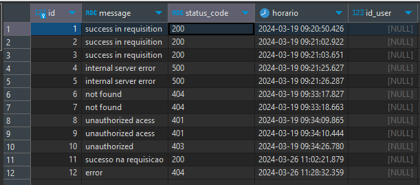
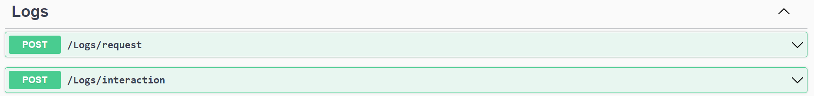
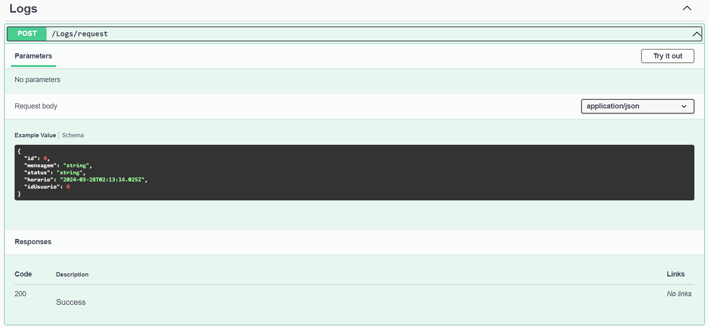
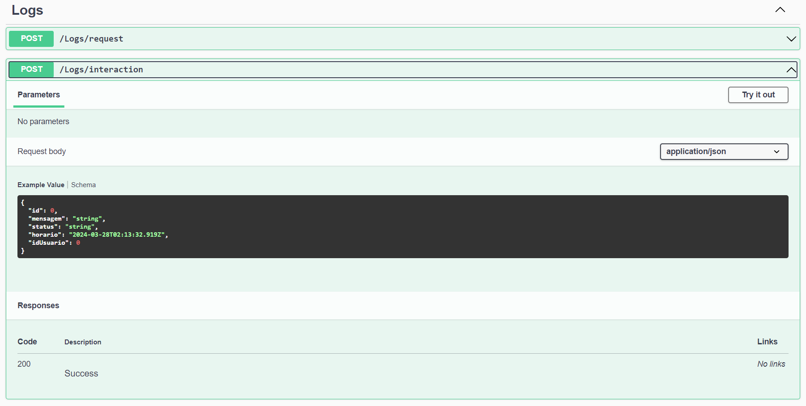
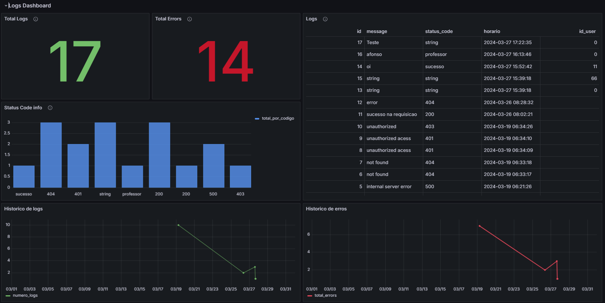

# Sumário

[1. Tabela de logs](#c1)

[2. Grafana](#c2)

[3. Sonarqube](#c3)

[4. Resultado do nosso Sonarqube](#c4)

<br>

# <a name="c1"></a> 1. Tabela de logs

&emsp;&emsp; Com o intuito de armazenar os logs, foi desenvolvida uma tabela, responsável por registrar informações sobre as interações do sistema e o momento em que elas ocorreram. Implementada em um banco de dados PostgreSQL, foi disponibilizada para acesso por meio do Render. Segue abaixo os campos presentes na tabela:

- id: Reponsável por registrar de forma incremental o id de cada log.

- Message: Registra a mensagem completa do log.

- status_code: Número do status code da requição.

- Horário: Horário em que o log foi registrado.

- id_user: Usuário que realizou a ação.

Observação: caso necessário para a correção, solicitar as credenciais ao time.

&emsp;&emsp; Abaixo apresenta-se a tabela criada:



Figura 1: Tabela de Logs <br>
Fonte: Autoria Própria

# <a name="c2"></a> 2. Logs

&emsp;&emsp;O objetivo é registrar eventos do sistema, incluindo mensagens de erro, status e horários, para permitir uma análise rápida a problemas na produção. Fundamental para a manutenção da estabilidade de um sistema, ao registrar os eventos é possível identificar problemas potenciais, diagnosticar falhas e implementar correções, garantindo uma experiência contínua e confiável para os usuários.

&emsp;&emsp;A funcionalidade de Gestão de Erros e Logs foi implementada seguindo a arquitetura MVC (Model-View-Controller), garantindo uma organização modular e uma separação clara de responsabilidades no sistema.

O modelo de dados utilizado para representar os logs é definido pela classe LogsModel que contém os seguintes atributos:
- Id: Identificador único do log.

- Mensagem: Descrição do evento ou mensagem de erro.

- Status: Status do evento.

- Horario: Data e hora em que o evento ocorreu.

- IdUsuario: Identificador do usuário associado ao evento (opcional).


## 2.1 Visualização
Abaixo, nas figuras 2, 3 e 4, são apresentados os registros dos logs documentados nos endpoints do Swagger.


&emsp;&emsp; 

Figura 2: Logs  <br>
Fonte: Autoria Própria


Figura 3: Logs Endpoint <br>
Fonte: Autoria Própria


Figura 4: Logs Endpoint 2 <br>
Fonte: Autoria Própria


# <a name="c3"></a> 3. Grafana

&emsp;&emsp; Com o propósito de monitorar os logs do sistema e controlar seu status diariamente, foi implementado um dashboard no Grafana, fornecendo uma visão geral dos logs e registrando todos os eventos ocorridos, além de métricas específicas sobre os códigos de status mais frequentes. 

&emsp;&emsp; Segue abaixo a imagem do Grafana criado:


Figura 5: Dashboard Grafana <br>
Fonte: Autoria Própria

# <a name="c4"></a> 4. Sonarqube

## Passo 1: Inserir o arquivo docker-compose.yml em uma pasta chamada "sonarqube"

&emsp;&emsp; O arquivo docker-compose é utilizado para definir e gerenciar aplicativos no Docker de forma simplificada. Ele utiliza arquivos YAML para descrever os serviços, redes e volumes necessários para executar um aplicativo, permitindo que você defina toda a configuração do ambiente em um único arquivo. Cole esse código no arquivo criado:

```
version: "3.8"
services:
    sonarqube:
        container_name: sonarqube
        image: sonarqube
        depends_on:
            - sonarqube-database
        environment:
            - SONARQUBE_JDBC_USERNAME=sonarqube
            - SONARQUBE_JDBC_PASSWORD=sonarpass
            - SONARQUBE_JDBC_URL=jdbc:postgresql://sonarqube-database:5432/sonarqube
        volumes:
            - sonarqube_conf:/opt/sonarqube/conf
            - sonarqube_data:/opt/sonarqube/data
            - sonarqube_extensions:/opt/sonarqube/extensions
            - sonarqube_bundled-plugins:/opt/sonarqube/lib/bundled-plugins
        ports:
            - 9001:9000

    sonarqube-database:
        container_name: sonarqube-database
        image: postgres:12
        environment:
            - POSTGRES_DB=sonarqube
            - POSTGRES_USER=sonarqube
            - POSTGRES_PASSWORD=sonarpass
        volumes:
            - sonarqube_database:/var/lib/postgresql
            - sonarqube_database_data:/var/lib/postgresql/data
        ports:
            -   5432:5432


volumes:
    sonarqube_database_data:
    sonarqube_bundled-plugins:
    sonarqube_conf:
    sonarqube_data:
    sonarqube_database:
    sonarqube_extensions:
```

## Passo 2: Subir o docker

&emsp;&emsp; Você deve abrir o aplicativo do _Docker Desktop_ e esperar ele abrir. Após isso você deve acessar o _Terminal_, acessar a pasta criada no passo anterior ("sonarqube") e acessar o _wsl_.

```
docker compose up -d   
```


Figura 1: Print do terminal

## Passo 3: Acessar o localhost

&emsp;&emsp; Acesse o link: http://localhost:9001/ , definido no arquivo implementado no passo anterior. Quando o docker subir e o site carregar, você deverá inserir como usuário: _admin_ e senha: _admin_, a plataforma irá pedir para você redefinir a senha. É de extrema de importância que você guarde essa senha para os próximos passos.

## Passo 4: Criar o projeto na plataforma

&emsp;&emsp; Dentro da plataforma, você deverá criar um novo projeto localmente, e criar um nome (importante: o nome não deve ter espaços, crie por exemplo: backend-grupo1). Após isso, é necessário selecionar a opção de _Use the global setting_, como mostra a imagem abaixo. Com isso feito, podemos criar o arquivo _sonar-project.properties_ dentro da pasta do projeto que você deseja, esse arquivo deve ter:


```
sonar.projectKey=NOME_DO_PROJETO
sonar.sources=.
sonar.host.url=http://localhost:9001
sonar.login=admin
sonar.password=SENHA_CRIADA
```
Considere que as palavras com letras maíusculas são particulares de cada um. 

## Passo 5: Continuar a configuração do projeto

&emsp;&emsp; Voltando para o Sonarqube, devemos subir o nosso projeto, para isso devemos escolher a opção _local_, como mostra a imagem abaixo. Com isso, podemos gerar o _token_ para o nosso projeto.


## Passo 6: Subir o projeto

&emsp;&emsp; Para subirmos no docker o nosso projeto, é necessário rodar o código abaixo no _wsl_ dentro da pasta do seu projeto. Considere que as palavras com letras maíusculas são particulares de cada um. 

```
docker run \
  -e SONAR_HOST_URL="http://host.docker.internal:9001" \
  -e SONAR_LOGIN="TOKEN_GERADO_NO_PASSO_5" \
  -v "${PWD}:/usr/src" \
  sonarsource/sonar-scanner-cli \
  -Dsonar.projectKey=NOME_DO_PROJETO \
  -Dsonar.sources=. \
  -Dsonar.host.url=http://host.docker.internal:9001 \
  -Dsonar.login=admin
```

Resultado final:


# <a name="c5"></a> 5. Resultado do nosso Sonarqube

&emsp;&emsp; Nosso backend obteve esses resultados:


&emsp;&emsp; Nosso frontend obteve esses resultados:


