# Autenticação Backend

# Auth0

Plataforma de autenticação e autorização que simplifica a integração de recursos de autenticação em uma variedade de aplicativos, incluindo aqueles voltados para a web, dispositivos móveis e APIs. Oferece aos desenvolvedores uma solução para implementar sistemas de login e proteção de recursos sem a necessidade de lidar com a complexidade inerente à segurança de identidade.

## Configuração do Auth0

1. Acesse [Auth0 Sign Up](https://auth0.com/signup?place=header&type=button&text=sign%20up) e faça login com o GitHub.

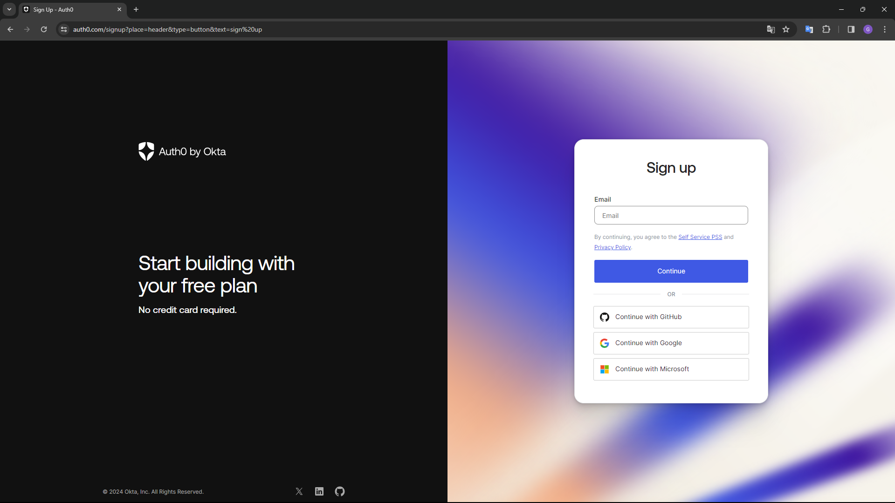<br>
Figura 1 : Login<br>
Fonte: Autoria Própria

2. Clique em "Applications" no menu lateral e acesse a aba "Applications".

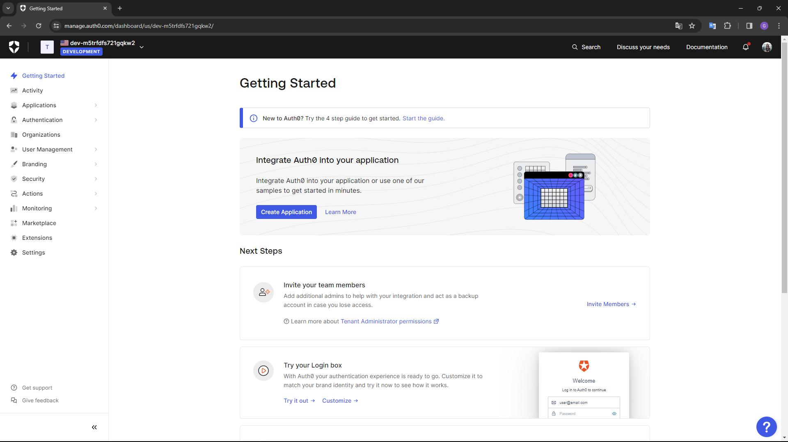<br>
Figura 2 : Home<br>
Fonte: Autoria Própria

3. No botão "Create Application", você pode criar a aplicação alterando as configurações necessárias. Neste caso, foi criada a aplicação "FuscaDashboard.WebApi".

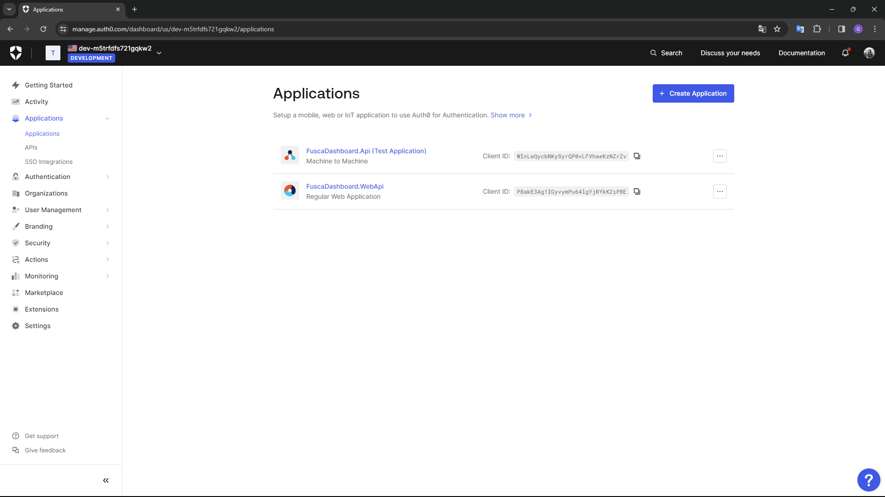<br>
Figura 3 : Aplicações<br>
Fonte: Autoria Própria
<br>

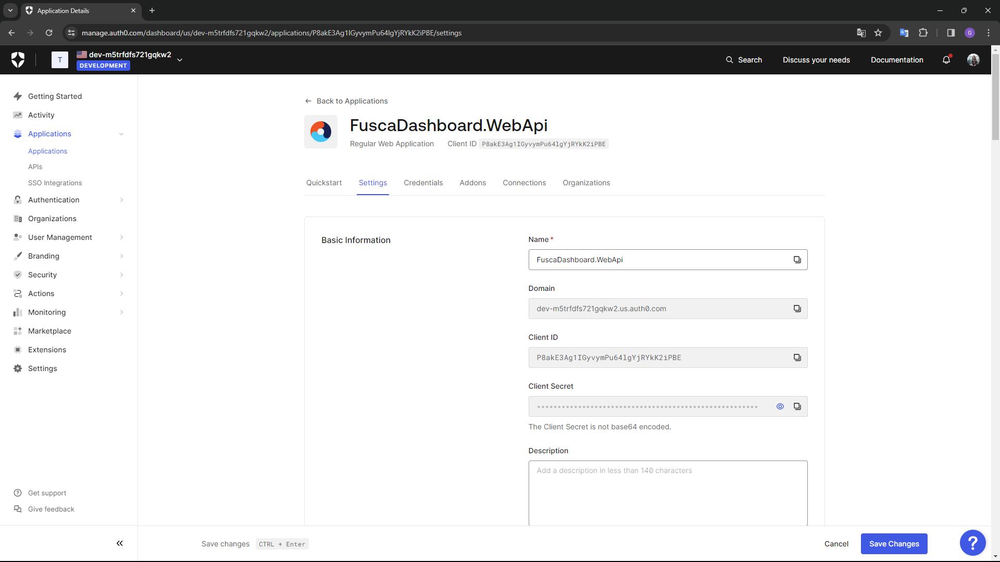<br>
Figura 4 : FuscaDashboard.WebApi<br>
Fonte: Autoria Própria
<br>

4. Na página da aplicação, vá para as configurações avançadas e na aba "Grant Types", selecione a autenticação por senha.

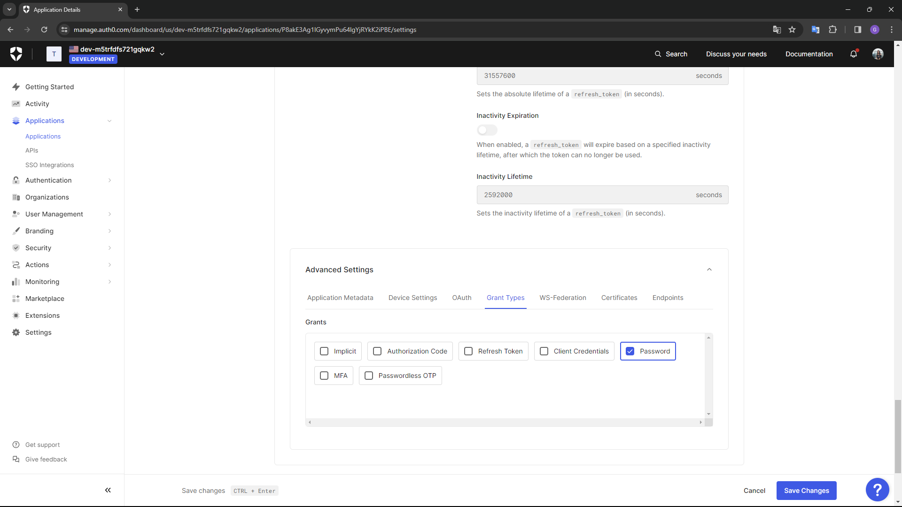<br>
Figura 5 : Tipo de autenticação<br>
Fonte: Autoria Própria


5. Clique em "APIs" no menu lateral e acesse a aba "APIs". No botão "Create API", você pode criar a aplicação alterando as configurações necessárias. Neste caso, a nossa API é a "FuscaDashboard.Api".

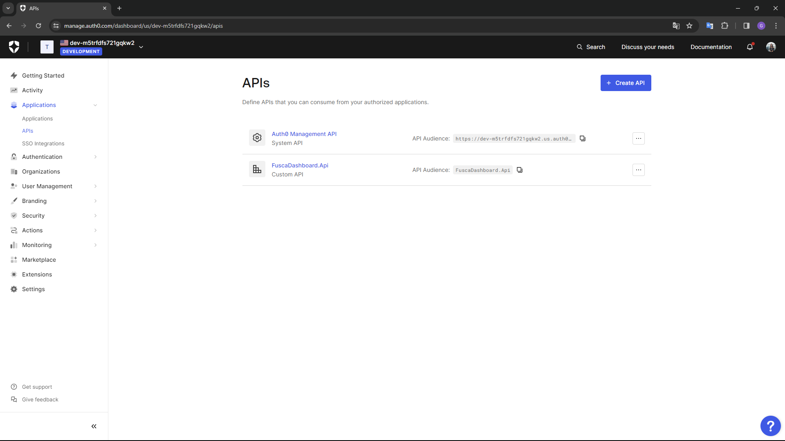<br>
Figura 6 : APIs<br>
Fonte: Autoria Própria

6. Na aba "Test", é possível visualizar as credenciais necessárias para gerar o token de acesso aos endpoints.

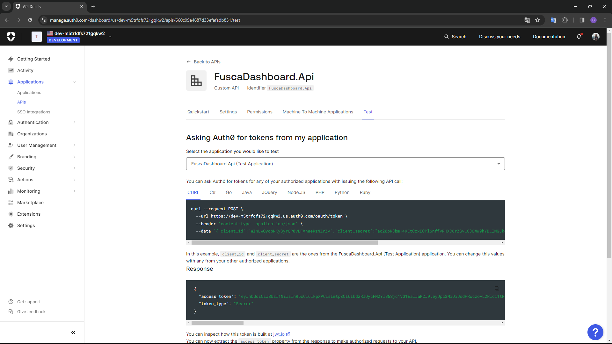<br>
Figura 7 : Token<br>
Fonte: Autoria Própria

7. Clique em "User Management" no menu lateral e acesse a aba "Users" para visualizar os usuários cadastrados. Se necessário, clique em "Create User" para liberar acesso a outros usuários.

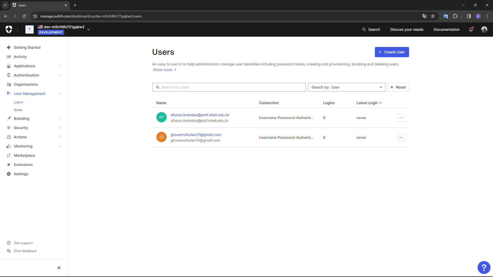<br>
Figura 8 : Users<br>
Fonte: Autoria Própria

8.  Dentro de cada usuário, nas abas "Permissões" e "Roles", é possível determinar quais permissões aquele usuário tem na aplicação e quais são as roles específicas que ele poderá utilizar no sistema. Por exemplo, as páginas para CEO, RH e Médicos têm acessos distintos que são liberados nesse momento.

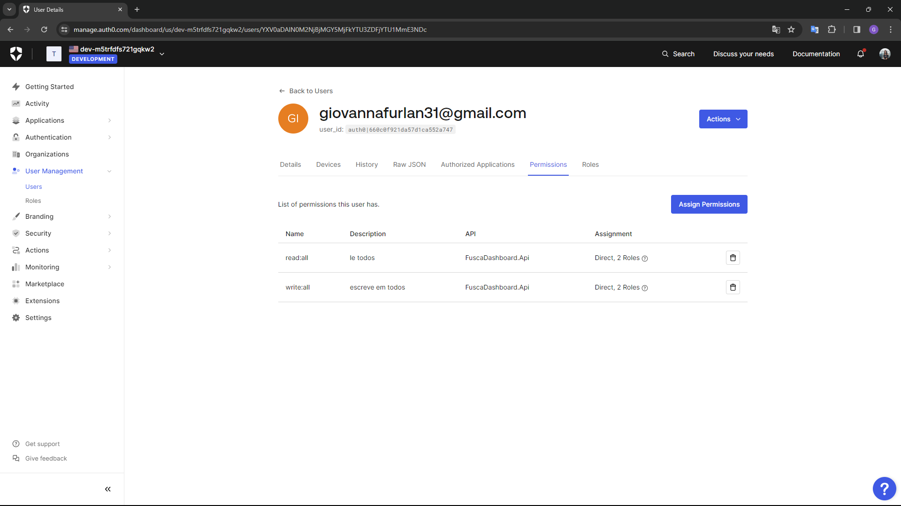<br>
Figura 9 : Permissões Usuário<br>
Fonte: Autoria Própria

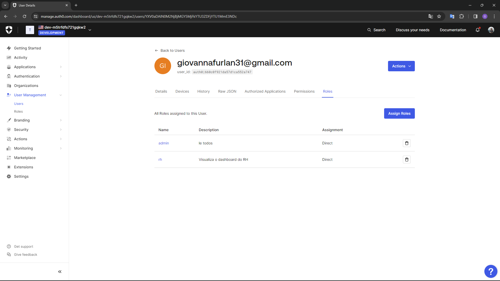<br>
Figura 10 : Roles Usuário<br>
Fonte: Autoria Própria

9. Clique em "User Management" no menu lateral e acesse a aba "Roles" para visualizar as roles criadas. Para criar uma nova role, clique em "Create Role".

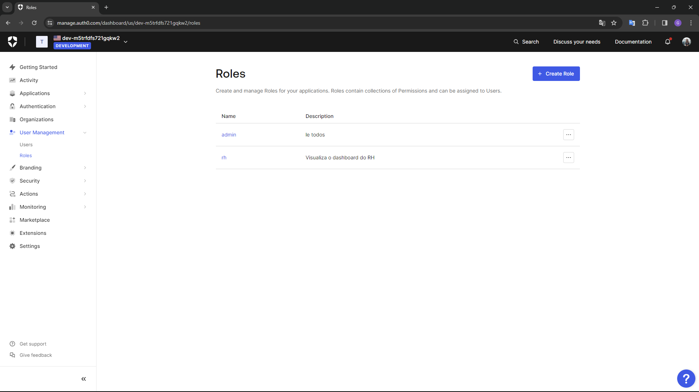<br>
Figura 11 : Roles<br>
Fonte: Autoria Própria

<br>

**Observação:** As "roles" definem conjuntos de permissões atribuídas a usuários, enquanto as "permissões" concedem acesso a recursos específicos. Roles agrupam permissões e simplificam o controle de acesso, enquanto permissões definem ações que os usuários podem executar em recursos. 

# Configuração do Backend

Para aplicar o Auth0 no backend do sistema foi necessário a adição de alguns códigos, sendo eles:

## 1. Program.cs

Embaixo do último repository declarado adicione: 

```C#
IdentityModelEventSource.ShowPII = true;
 
builder.Services.AddAuthentication(x =>
{
    x.DefaultAuthenticateScheme = JwtBearerDefaults.AuthenticationScheme;
    x.DefaultChallengeScheme = JwtBearerDefaults.AuthenticationScheme;
}).AddJwtBearer(options =>
{
    options.Authority = "<<url do auth0>>";
    options.Audience = "<<audience do auth0>>";
    options.TokenValidationParameters = new TokenValidationParameters
    {
        ValidateIssuer = true,
        ValidateAudience = true,
        ValidateLifetime = true,
        ValidateIssuerSigningKey = true,
        ValidIssuer = "<<url do auth0>>",
        ValidAudience = "<<audience do auth0>>"
    };
});
```


**Observação:** 
- **"url do auth0"** é fornecida dentro de Aplications --> Settings --> Domain no Auth0.
- **"audience do auth0"** é o nome dado a sua API no Auth0.

## 2. Validators

Crie uma pasta chamada "Validators" e dentro dela um arquivo com o nome "TokenValidator.cs". No arquivo adicione o código abaixo: 


```C#
using System;
using System.IdentityModel.Tokens.Jwt;
using System.Security.Claims;

namespace Fusca.Dashboard.WebApi.Validators
{
    public class TokenValidator
    {
        public static void GetPermissionFromToken(string token)
        {
            if (string.IsNullOrEmpty(token))
            {
                throw new ArgumentNullException(nameof(token), "Token cannot be null or empty.");
            }

            var handler = new JwtSecurityTokenHandler();

            try
            {
                var tokenS = handler.ReadJwtToken(token);

                var claims = tokenS.Claims;

                foreach (Claim claim in claims)
                {
                    Console.WriteLine($"Tipo de Reivindicação: {claim.Type}, Valor: {claim.Value}");
                }
            }
            catch (Exception ex)
            {
                Console.WriteLine($"Erro ao validar token: {ex.Message}");
            }
        }
    }
}

```

## 3. Controller

No "Controller" adicione o Authorize após o HttpGet. 

```C#
    [HttpGet]
    [Authorize]
```
É necessário também acrescentar o código abaixo antes do return do seu endpoint.

```C#
string token = Request.Headers["Authorization"].ToString().Replace("Bearer ", "");
TokenValidator.GetPermissionFromToken(token);
```

## 4. Teste

```C#
using NUnit.Framework;
using Fusca.Dashboard.WebApi.Validators;
using System;

namespace Fusca.Dashboard.Tests
{
    [TestFixture]
    public class TokenZenKlubTest
    {
        [Test]
        public void GetPermissionFromToken_ValidToken_Success()
        {
            string token = "insira_o_token";
            Assert.DoesNotThrow(() => TokenValidator.GetPermissionFromToken(token));
        }

        [Test]
        public void GetPermissionFromToken_NullToken_ThrowsArgumentNullException()
        {
            string emptyToken = "";
            Assert.Throws<ArgumentNullException>(() => TokenValidator.GetPermissionFromToken(emptyToken));
        }

    }
}

```

### 4.1 Resultado do Teste

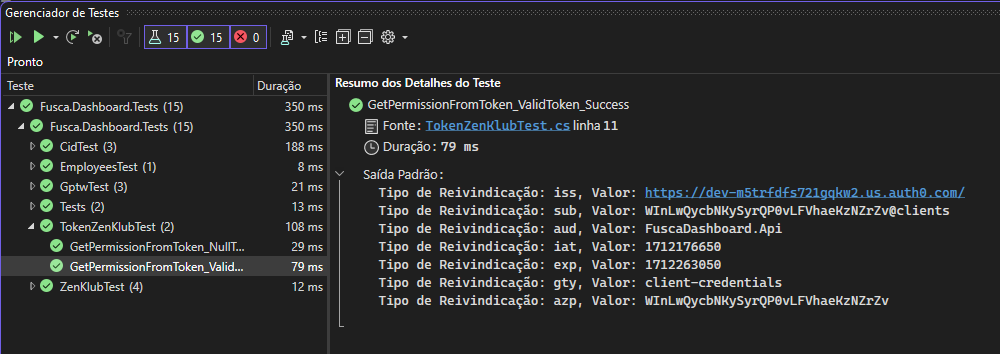<br>
Figura 12 : Teste Autenticação<br>
Fonte: Autoria Própria


## JWT (JSON Web Token)

Mecanismo seguro para verificar a autenticidade e integridade dos tokens gerados na aplicação. Ao gerar um token JWT, codifica-se informações relevantes, como identificação do usuário, permissões e outras metainformações necessárias para autenticação e autorização. Em seguida, assina-se digitalmente esse token para garantir que ele não tenha sido adulterado durante a transmissão.

Para validar se o token remete à aplicação criada utilizou-se a função de codificação e decodificação fornecida pelo site [JWT](https://jwt.io/) para extrair as informações contidas nele. Em seguida, verificamos se essas informações correspondem às expectativas e se a assinatura do token é válida, garantindo assim que ele foi gerado pela aplicação e não foi modificado por terceiros durante a transmissão. Tal processo é demonstrado na imagem abaixo:


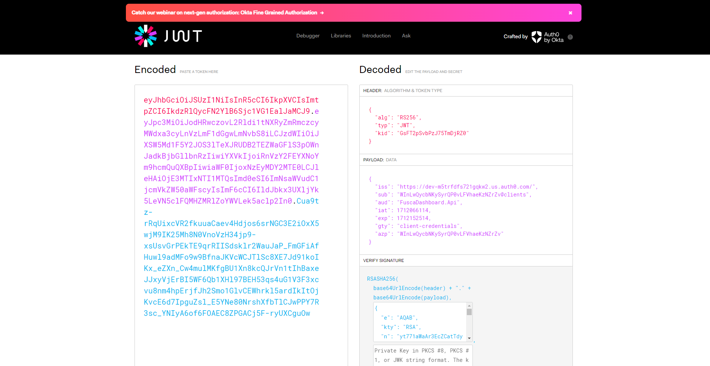<br>
Figura 13 : Token JWT<br>
Fonte: Autoria Própria

# Demonstração

As próximas seções deste documento têm como objetivo fornecer um guia passo a passo sobre como obter o token necessário para acessar os endpoints da aplicação. Uma vez que, após a implementação da autenticação no sistema, quando um usuário tenta acessar um endpoint através do Swagger, o acesso é negado devido à falta do token de segurança, como demonstrado na imagem abaixo.

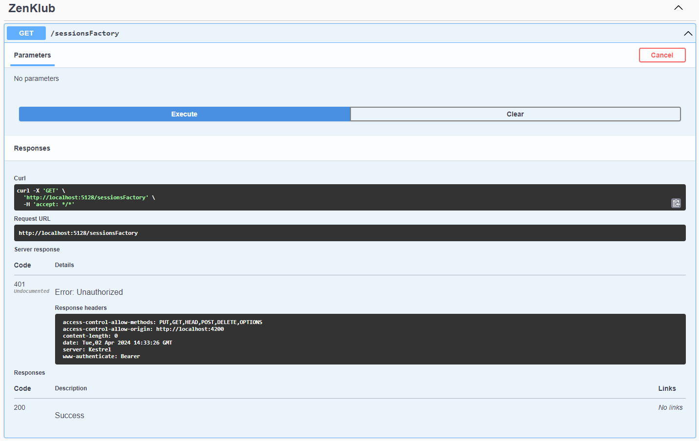<br>
Figura 14 : Swagger ZenKlub<br>
Fonte: Autoria Própria
<br>

## Aplicação 

Para garantir a correta autenticação no acesso aos endpoints desenvolvidos, foi utilizado o Postman para testes locais. Este processo envolve a utilização das credenciais fornecidas pelo Auth0, bem como a URL da API para a geração do token de acesso. Conforme exibido na figura 15 abaixo. 

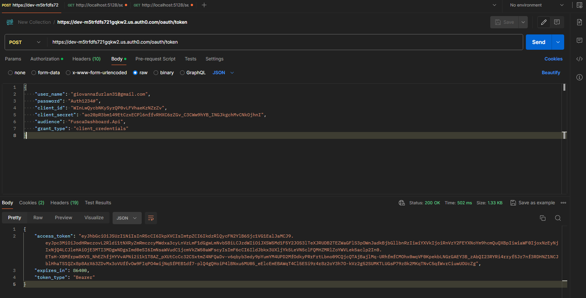<br>
Figura 15 : Postman - Gerar Token<br>
Fonte: Autoria Própria

Quando o get é realizado sem a inclusão do token gerado, o acesso aos endpoints resulta em erro de permissão, indicando a falta de autorização para visualizar as informações. No entanto, ao adicionar o token no cabeçalho da requisição, é possível obter acesso aos dados desejados.

Este processo destaca a importância da implementação da autenticação nos endpoints da API, garantindo que apenas usuários autorizados possam acessar e visualizar as informações disponíveis. As figuras 16 e 17 abaixo ilustram os resultados obtidos durante, mostrando a diferença entre o acesso sem autenticação e o acesso com o token gerado pelo Auth0.

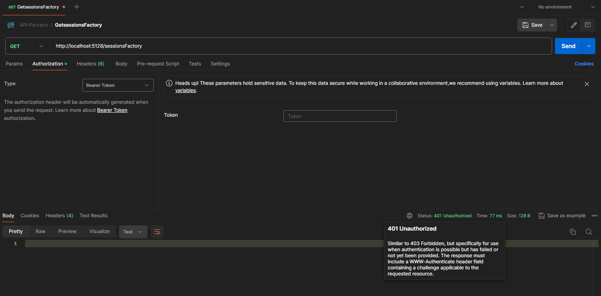<br>
Figura 16 : Postman - Token Erro<br>
Fonte: Autoria Própria
<br>

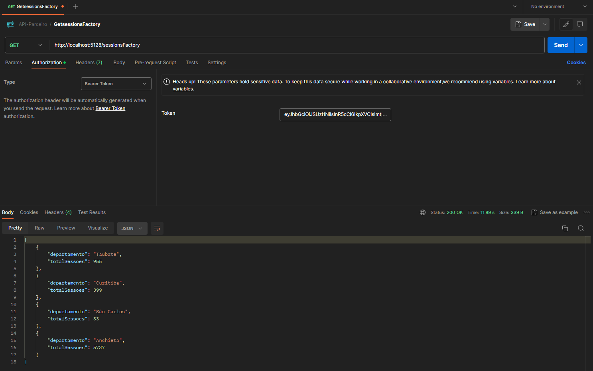<br>
Figura 17 : Postman - Token Sucesso<br>
Fonte: Autoria Própria
<br>

# Resultados Esperados


Segue o link do vídeo com a demonstração da autenticação : https://youtu.be/Pbdf7yaTFVs


# Credêncial 

## **Body**

```JSON
curl --request POST \
  --url https://dev-m5trfdfs721gqkw2.us.auth0.com/oauth/token \
  --header 'content-type: application/json' \
  --data '{"client_id":"WInLwQycbNKySyrQP0vLFVhaeKzNZrZv","client_secret":"ao20pR3bm149EtCzxECPl6nffvRHXC6rZGv_C3CWw9hYB_INGJkgchMvCNkOjhnI","audience":"FuscaDashboard.Api","grant_type":"client_credentials"}'
```

## **Usuário 1**

- giovannafurlan31@gmail.com
- Auth1234#

## **Usuário 2**

- afonso.brandao@prof.inteli.edu.br
- Afonsoprof1234#


<br>

# Autenticação Frontend

A autenticação no front-end desempenha um papel fundamental, garantindo que apenas usuários autorizados tenham acesso aos recursos e funcionalidades disponibilizados. Para acessar serviços específicos, podemos garantir que somente usuários autorizados possam interagir com as funcionalidades críticas, mantendo a segurança e a privacidade dos dados.

A importância da autenticação no front-end nos serviços é evidente não apenas em termos de segurança, mas também em termos de conformidade com regulamentações de proteção de dados, como a LGPD (RLei Geral de Proteção de Dados). Portanto, ao adotar práticas de autenticação estamos não apenas protegendo os interesses da empresa, mas também garantindo o cumprimento das regulamentações e padrões de segurança exigidos.

## Configurações Iniciais

- BASE_URL: URL base do ambiente onde a API está hospedada.
- AUTH_URL: URL de autenticação do serviço de autenticação utilizado (no exemplo, Auth0).
- AUDIENCE: Público-alvo da autenticação, geralmente o nome da API.
- CLIENT_ID e CLIENT_SECRET: Credenciais do cliente para autenticação.
- AUTH_TOKEN: Variável para armazenar o token de autenticação.


```C#
  BASE_URL = environment.apiUrl;
  AUTH_URL = 'https://dev-m5trfdfs721gqkw2.us.auth0.com/oauth/token';
  AUDIENCE = 'FuscaDashboard.Api';
  CLIENT_ID = environmentAuth.clientId;
  CLIENT_SECRET = environmentAuth.clientSecret;
  AUTH_TOKEN = "";
  
  constructor(private http: HttpClient) { }
```

## Descrição do Código

- getToken(): Método para obter o token de autenticação. Realiza uma solicitação HTTP POST para o AUTH_URL com as credenciais do cliente. Retorna o token de acesso obtido na resposta.

```C#
  getToken(): Observable<any> {
    const body = {
      client_id: this.CLIENT_ID,
      client_secret: this.CLIENT_SECRET,
      audience: this.AUDIENCE,
      grant_type: 'client_credentials'
    };

    const headers = new HttpHeaders({ 'Content-Type': 'application/json' });

    return this.http.post<any>(this.AUTH_URL, body, { headers: headers }) 
      .pipe(
        map((response: any) => response.access_token)
      );
  }
```

- getNomeDoEndpoint(): Método de exemplo para acessar um endpoint protegido pela autenticação. Obtém o token de acesso chamando getToken(). Adiciona o token de acesso aos cabeçalhos da solicitação HTTP. Realiza uma solicitação HTTP GET para o endpoint desejado.


```C#
  getNomeDoEndpoint(): Observable<HttpResponse<any>> {
    const accessToken = this.getToken();
    const headers = new HttpHeaders({ 'Authorization': `Bearer ${accessToken}` });
    return this.http.get<any>(`${this.BASE_URL}/nomeEndpoint`, { headers: headers, observe: 'response' })
    ;
  }
```

## Observações

- Este código utiliza o padrão de Observables do Angular para lidar com requisições assíncronas.
- Certifique-se de substituir os valores das variáveis ​​de ambiente (environment.apiUrl, environmentAuth.clientId, environmentAuth.clientSecret) pelos valores adequados para o seu ambiente.