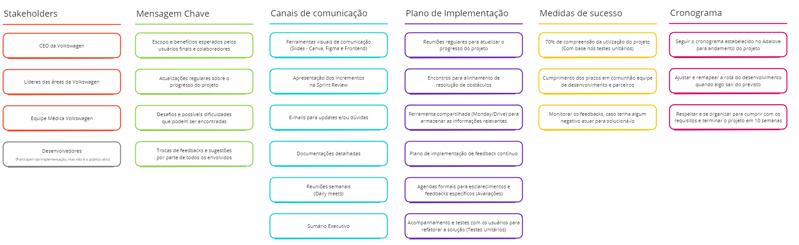

# Plano de comunicação

O Plano de Comunicação é uma peça-chave para o sucesso de um projeto, e tem como intuito fornecer e estabelecer as bases de como as informações serão transmitidas, recebidas e gerenciadas dentro de um projeto ou organização. Dessa forma, serve como um guia abrangente para todas atividades de comunicação e visa garantir com que as mensagens sejam efetivamente entregues aos públicos-alvo, que a compreensão seja alcançada e que o feedback seja coletado de maneira sistemática. Na imagem abaixo demonstra-se o plano criado

  

## Objetivo

O propósito claro do plano de comunicação é assegurar o alinhamento e compreensão entre todos os participantes do projeto, estabelecendo uma base sólida para um progresso coordenado e eficiente. Em projetos extensos, diversas peças fundamentais desempenham papéis cruciais em várias fases da gestão e desenvolvimento. Este plano destaca os principais stakeholders que desempenham um papel vital.

### Stakeholders

Destacamos inicialmente o impacto do tive de desenvolvimento, que, com o suporte da equipe docente do Inteli, é responsável por criar a solução para os usuários finais. Além disso, os líderes, médicos e CEO da Volkswagen desempenham papéis essenciais, pois a solução está sendo desenvolvida para atender às suas necessidades. É imperativo ouvir seus feedbacks, opiniões e sugestões para garantir a criação da melhor solução possível. Compreender a relevância e o impacto desses stakeholders no projeto é fundamental para uma boa comunicaçãa.

### Mensagens chaves

- Ao considerar os usuários finais, focamos nas mensagens que abrangem o escopo do projeto e nos benefícios esperados. Reconhecemos a importância de manter esses stakeholders informados sobre o progresso do projeto, destacando as atualizações regulares como uma prioridade para garantir sua compreensão e envolvimento contínuo. Além disso, conscientes dos desafios e dificuldades que podem surgir, incluímos esses aspectos em nossas mensagens, demonstrando transparência e preparando os usuários finais para possíveis obstáculos.
- Ao nos voltarmos para a equipe de desenvolvimento, adaptamos as mensagens chave para refletir não apenas os objetivos gerais do projeto, mas também a relevância específica de seu impacto na concepção e desenvolvimento da solução. Enfatizando sempre a importância do seu papel na criação da solução.

### Canais de comunicação

Os canais de comunicação selecionados foram escolhidos para atender às demandas de cada grupo de stakeholders. Ao direcionar nossa atenção para os usuários finais, optamos por ferramentas visuais, como Canvas e Figma, e apresentações durante os encontros de Sprint. Essa abordagem visa não apenas proporcionar informações de maneira visualmente atrativa, mas também criar uma interação que promova uma compreensão mais profunda do progresso do projeto.

Em relação à frequência da comunicação, cada canal foi ajustado para atender às expectativas de cada grupo de stakeholders. Reuniões semanais e Sumário Executivo ao final de cada Sprint garantem uma atualização regular, ao passo que a flexibilidade proporcionada pelos e-mails permite respostas rápidas e esclarecimento de dúvidas.

### Plano de implementação

As reuniões regulares desempenham um papel de fornecer atualizações durante as sprints, revisando entregáveis e criando um fórum para manter todos os stakeholders informados sobre o progresso. A utilização de uma plataforma centralizada para armazenar informações facilita o acesso e promove a colaboração ao consolidar dados cruciais em um local acessível a todos.

A consideração cuidadosa dos recursos disponíveis é evidente no plano, que inclui reuniões formais agendadas em pontos específicos para otimizar o uso eficiente do tempo dos stakeholders. Além disso, a programação de revisões formais em momentos específicos demonstra uma abordagem para esclarecer dúvidas e revisar conteúdos, maximizando a utilização dos recursos. A análise dos possíveis obstáculos é uma característica distintiva, com reuniões periódicas dedicadas a discutir obstáculos e soluções, mitigando possíveis complicações.

### Medidas de sucesso

O cumprimento dos prazos em conjunto com o grupo. Esta métrica é não apenas mensurável, mas também tangível, fornecendo uma base para avaliar se a comunicação está resultando em ações coordenadas, no qual o monitoramento dos feedbacks torna-se uma prática essencial. Além de ser necessário que os usuários consigam realizar os testes e utilizar a solução futuramente. 

 
 

# Pós Projeto

## Propósito

O propósito central de nosso plano de comunicação é promover a nossa solução para os possíveis usuários da mesma. Procurando convencer tanto os líderes da área do banco quanto os membros da área médica sobre as utilidades da solução e o porquê seria vantajoso para eles a aderirem. Uma vez que, mesmo entregando uma boa solução, ela só será realmente útil caso seja aderida pelos usuários. A imagem abaixo apresenta os tópicos gerais e referentes as 10 semanas de desenvolvimento do projeto. 

## Público-alvo/stakeholders

### CEO

- Ainda não possui contato com a solução.
- Nível médio de interesse na solução. Uma vez que a solução traz insights sobre todas as áreas da empresa, possibilitando que ele tenha uma visão geral da empresa. Embora facilite a vida do CEO em reunir todos os dados em um lugar, o dashboard provavelmente trará informações com as quais ele já tem contato todos os dias.

### Líderes de área VW

- Ainda não possuem contato com a solução.
- Alto interesse na solução. Uma vez que, além de trazer informações gerais de forma fácil sobre a VW, trará informações específicas sobre suas áreas. Permitindo que saibam o desempenho de sua área em relação à VW, assim possibilitando que conheçam seus pontos fortes e fracos.

### Equipe médica VW

- Apenas um contato superficial de alguns membros da área com a solução em estágio inicial, ainda é necessário para a equipe médica ter um conhecimento mais abrangente sobre sua situação atual da solução.
- Alto interesse, pois possibilita que atuem preventivamente na manutenção da saúde dos funcionários, permitindo que identifiquem e atuem nos principais casos de atestados em cada área. Possibilitando que prestem um auxílio médico personalizado.

## Mensagens-chave

Cada Stakeholder do projeto possui suas peculiaridades e necessidades, sendo necessário transmitir uma mensagem específica para cada um.

### CEO/Líderes de área VW.

Para esses stakeholders, a mensagem deve destacar os benefícios que a solução pode trazer para a empresa e para suas respectivas áreas. A mensagem deve abordar principalmente pontos como a possibilidade de melhorar o desempenho das áreas, uma vez que será possível ver a nota de uma determinada área em relação à VW, permitindo que descubram e atuem em pontos fracos. Outro ponto que também pode ser trabalhado é a questão da economia de tempo, prometendo que ao concentrar todas as informações em apenas um lugar, será reduzido o tempo que eles gastam procurando informações. Sendo assim, uma comunicação pautada em economia de tempo e melhora de desempenho.

### Equipe Médica.

Já para a equipe médica, o foco da mensagem deve ser na eficiência no trabalho. Uma vez que a vantagem central deles é focada na possibilidade de identificar os principais problemas de cada unidade. Possibilitando que sejam tomadas medidas personalizadas e preventivas em relação a esses problemas. Assim, tornando suas medidas muito mais eficazes.

## Canais de comunicação.

Levando em conta tanto o sigilo das informações trabalhadas pela solução quanto o tamanho da VW Brasil, o canal de comunicação escolhido para difundir a solução foi o email. Essa escolha se deve ao fato dos emails possuírem algumas características como serem internos, possibilitando que as informações sejam enviadas para todas as unidades e apenas para os usuários da solução, abrangente, podendo atingir simultaneamente todas as unidades, e rápidos para consumir, possibilitando que até mesmo o CEO consiga ficar ciente da solução desenvolvida. Além disso, vale mencionar também a possibilidade de emails personalizados para cada mensagem-chave. Assim, tornando o email o melhor canal de comunicação para difundir a solução.

## Cronograma

Já em relação ao cronograma, o ideal seria que uma semana após a implementação do projeto que sejam disparados pelo menos 3 emails, com espaçamento de 2 dias entre eles, contendo as informações mencionadas no tópico de mensagem-chave, tanto para CEO e líderes de área VW quanto para a equipe médica. Assim, garantindo que todos consigam visualizar a nova ferramenta, e que sejam transmitidas mensagens personalizadas de acordo com o interesse de cada público-alvo.

